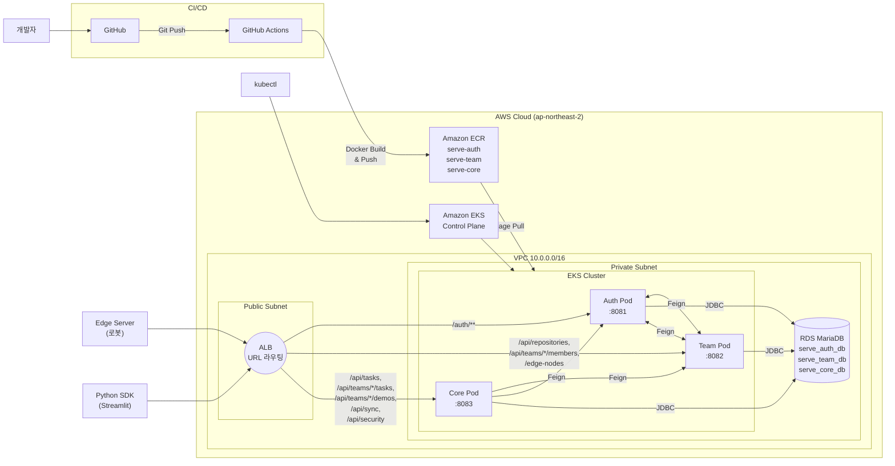

# SeRVe Server - AWS EKS 배포 계획서

## 1. 개요

SeRVe MSA 프로젝트(Auth, Team, Core)를 AWS EKS 환경에 배포하기 위한 계획서입니다.
현재 Docker Compose + Nginx 기반 로컬 환경에서 운영 중인 시스템을 AWS 클라우드 네이티브 아키텍처로 전환합니다.

### 1.1 현재 환경 → 목표 환경

| 항목 | 현재 (로컬) | 목표 (AWS) |
|------|-----------|-----------|
| API Gateway | Nginx (:8080) | AWS ALB (Application Load Balancer) |
| 컨테이너 오케스트레이션 | Docker Compose | Amazon EKS (Kubernetes) |
| 컨테이너 레지스트리 | 로컬 빌드 | Amazon ECR |
| 데이터베이스 | MariaDB Docker 컨테이너 | Amazon RDS (MariaDB) |
| CI/CD | 수동 빌드 | GitHub Actions → ECR → EKS |
| 서비스 디스커버리 | localhost + 포트 | Kubernetes Service (ClusterIP) |
| 시크릿 관리 | application.yml 하드코딩 | Kubernetes Secret (+ AWS Secrets Manager 옵션) |

### 1.2 목표 아키텍처

```
Edge Server / Client (Python SDK)
        │
        ▼
   ┌──────────┐
   │  AWS ALB  │  (Public Subnet, URL 기반 라우팅)
   └─────┬────┘
         │
    ┌────┴────────────────────────────────┐
    │         Private Subnet              │
    │  ┌──────────────────────────────┐   │
    │  │     EKS Cluster (SeRVe)      │   │
    │  │  ┌──────┐┌──────┐┌───────┐  │   │
    │  │  │ Auth ││ Team ││ Core  │  │   │
    │  │  │ Pod  ││ Pod  ││ Pod   │  │   │
    │  │  └──────┘└──────┘└───────┘  │   │
    │  └──────────────────────────────┘   │
    │                                     │
    │  ┌──────────────────────────────┐   │
    │  │   Amazon RDS (MariaDB)       │   │
    │  │  ┌──────┐┌──────┐┌───────┐  │   │
    │  │  │auth  ││team  ││core   │  │   │
    │  │  │_db   ││_db   ││_db    │  │   │
    │  │  └──────┘└──────┘└───────┘  │   │
    │  └──────────────────────────────┘   │
    └─────────────────────────────────────┘
```

---

## 2. AWS 인프라 구성

### 2.1 VPC 네트워크 설계

```
VPC: 10.0.0.0/16

├── Public Subnet A  (10.0.1.0/24, ap-northeast-2a)
│   └── ALB
├── Public Subnet B  (10.0.2.0/24, ap-northeast-2c)
│   └── ALB (Multi-AZ)
│
├── Private Subnet A (10.0.10.0/24, ap-northeast-2a)
│   ├── EKS Worker Node
│   └── RDS Primary
├── Private Subnet B (10.0.20.0/24, ap-northeast-2c)
│   ├── EKS Worker Node
│   └── RDS Standby (옵션)
│
└── NAT Gateway (Public Subnet A)
    └── Private Subnet → 외부 통신용 (ECR 이미지 Pull 등)
```

| 리소스 | 설명 |
|--------|------|
| **Public Subnet** (2개) | ALB 배치. 외부 트래픽 수신점 |
| **Private Subnet** (2개) | EKS 워커 노드 + RDS 배치. 외부 직접 접근 불가 |
| **NAT Gateway** | Private Subnet에서 외부(ECR, 패키지 등) 접근용 |
| **Internet Gateway** | Public Subnet의 인터넷 연결 |

### 2.2 Amazon EKS

| 항목 | 설정값 |
|------|--------|
| Kubernetes 버전 | 1.29+ |
| 노드 그룹 타입 | Managed Node Group |
| 인스턴스 타입 | `t3.medium` (2 vCPU, 4 GiB) |
| 노드 수 | 최소 2, 최대 4 (Auto Scaling) |
| 서브넷 | Private Subnet A/B |
| CNI | Amazon VPC CNI |

### 2.3 Amazon ECR

서비스별 3개의 ECR 리포지토리를 생성합니다.

| 리포지토리 | 이미지 태그 규칙 |
|-----------|----------------|
| `serve-auth` | `latest`, `v1.0.0`, `{commit-sha}` |
| `serve-team` | `latest`, `v1.0.0`, `{commit-sha}` |
| `serve-core` | `latest`, `v1.0.0`, `{commit-sha}` |

### 2.4 Amazon RDS (MariaDB)

| 항목 | 설정값 |
|------|--------|
| 엔진 | MariaDB 11.4 |
| 인스턴스 | `db.t3.micro` (개발/테스트) → `db.t3.small` (운영) |
| Multi-AZ | 개발: 비활성화 / 운영: 활성화 |
| 스토리지 | 20 GiB gp3 (Auto Scaling) |
| 서브넷 | Private Subnet (DB Subnet Group) |
| 보안 그룹 | EKS 워커 노드에서만 3306 인바운드 허용 |

**스키마 초기화:**

현재 `docker/init-db.sql` 파일의 내용을 RDS 생성 후 수동으로 실행합니다.

```sql
CREATE DATABASE IF NOT EXISTS serve_auth_db;
CREATE DATABASE IF NOT EXISTS serve_team_db;
CREATE DATABASE IF NOT EXISTS serve_core_db;
GRANT ALL PRIVILEGES ON serve_auth_db.* TO 'serve_user'@'%';
GRANT ALL PRIVILEGES ON serve_team_db.* TO 'serve_user'@'%';
GRANT ALL PRIVILEGES ON serve_core_db.* TO 'serve_user'@'%';
FLUSH PRIVILEGES;
```

### 2.5 AWS ALB (Application Load Balancer)

Nginx를 대체하여 ALB가 URL 기반 라우팅을 수행합니다.
EKS에서 AWS Load Balancer Controller를 사용하여 Ingress 리소스로 ALB를 자동 프로비저닝합니다.

**현재 Nginx 라우팅 → ALB 라우팅 매핑:**

| 경로 패턴 | 대상 서비스 (K8s Service) | 포트 |
|-----------|-------------------------|------|
| `/auth/*` | `serve-auth-svc` | 8081 |
| `/api/repositories*` | `serve-team-svc` | 8082 |
| `/api/teams/*/members*` | `serve-team-svc` | 8082 |
| `/edge-nodes/*` | `serve-team-svc` | 8082 |
| `/api/teams/*/tasks*` | `serve-core-svc` | 8083 |
| `/api/tasks*` | `serve-core-svc` | 8083 |
| `/api/teams/*/demos*` | `serve-core-svc` | 8083 |
| `/api/security/*` | `serve-core-svc` | 8083 |
| `/api/sync/*` | `serve-core-svc` | 8083 |

> **주의: 클라이언트 호환 Rewrite 처리**
> 현재 Nginx에서 수행하는 URL rewrite(`/api/documents` → `/api/tasks`, `/repositories/{id}/members` → `/api/teams/{id}/members`)는 ALB 단독으로 처리 불가합니다. 이를 해결하기 위해 두 가지 옵션이 있습니다:
>
> - **옵션 A**: 클라이언트 SDK를 새 URL 경로로 업데이트 (권장)
> - **옵션 B**: ALB와 EKS 사이에 Nginx Ingress Controller를 두어 rewrite 처리

---

## 3. Kubernetes 매니페스트

### 3.1 디렉토리 구조

```
k8s-manifests/
├── namespace.yaml
├── secrets.yaml
├── auth/
│   ├── deployment.yaml
│   └── service.yaml
├── team/
│   ├── deployment.yaml
│   └── service.yaml
├── core/
│   ├── deployment.yaml
│   └── service.yaml
└── ingress.yaml              # ALB Ingress
```

### 3.2 Namespace

```yaml
# k8s-manifests/namespace.yaml
apiVersion: v1
kind: Namespace
metadata:
  name: serve
```

### 3.3 Secrets

민감 정보를 Kubernetes Secret으로 관리합니다.

```yaml
# k8s-manifests/secrets.yaml
apiVersion: v1
kind: Secret
metadata:
  name: serve-secrets
  namespace: serve
type: Opaque
stringData:
  DB_HOST: "<RDS_ENDPOINT>"
  DB_USERNAME: "serve_user"
  DB_PASSWORD: "<RDS_PASSWORD>"
  JWT_SECRET: "<JWT_SECRET_KEY>"
```

> 운영 환경에서는 AWS Secrets Manager + External Secrets Operator 사용을 권장합니다.

### 3.4 Auth Service

```yaml
# k8s-manifests/auth/deployment.yaml
apiVersion: apps/v1
kind: Deployment
metadata:
  name: serve-auth
  namespace: serve
  labels:
    app: serve-auth
spec:
  replicas: 2
  selector:
    matchLabels:
      app: serve-auth
  template:
    metadata:
      labels:
        app: serve-auth
    spec:
      containers:
        - name: serve-auth
          image: <AWS_ACCOUNT_ID>.dkr.ecr.ap-northeast-2.amazonaws.com/serve-auth:latest
          ports:
            - containerPort: 8081
          env:
            - name: SPRING_DATASOURCE_URL
              value: "jdbc:mariadb://$(DB_HOST):3306/serve_auth_db?useSSL=false&characterEncoding=UTF-8&serverTimezone=Asia/Seoul"
            - name: SPRING_DATASOURCE_USERNAME
              valueFrom:
                secretKeyRef:
                  name: serve-secrets
                  key: DB_USERNAME
            - name: SPRING_DATASOURCE_PASSWORD
              valueFrom:
                secretKeyRef:
                  name: serve-secrets
                  key: DB_PASSWORD
            - name: JWT_SECRET
              valueFrom:
                secretKeyRef:
                  name: serve-secrets
                  key: JWT_SECRET
            - name: TEAM_SERVICE_URL
              value: "http://serve-team-svc.serve.svc.cluster.local:8082"
            - name: DB_HOST
              valueFrom:
                secretKeyRef:
                  name: serve-secrets
                  key: DB_HOST
          resources:
            requests:
              cpu: "250m"
              memory: "512Mi"
            limits:
              cpu: "500m"
              memory: "1Gi"
          readinessProbe:
            httpGet:
              path: /auth/health
              port: 8081
            initialDelaySeconds: 30
            periodSeconds: 10
          livenessProbe:
            httpGet:
              path: /auth/health
              port: 8081
            initialDelaySeconds: 60
            periodSeconds: 30
---
# k8s-manifests/auth/service.yaml
apiVersion: v1
kind: Service
metadata:
  name: serve-auth-svc
  namespace: serve
spec:
  selector:
    app: serve-auth
  ports:
    - port: 8081
      targetPort: 8081
  type: ClusterIP
```

### 3.5 Team Service

```yaml
# k8s-manifests/team/deployment.yaml
apiVersion: apps/v1
kind: Deployment
metadata:
  name: serve-team
  namespace: serve
  labels:
    app: serve-team
spec:
  replicas: 2
  selector:
    matchLabels:
      app: serve-team
  template:
    metadata:
      labels:
        app: serve-team
    spec:
      containers:
        - name: serve-team
          image: <AWS_ACCOUNT_ID>.dkr.ecr.ap-northeast-2.amazonaws.com/serve-team:latest
          ports:
            - containerPort: 8082
          env:
            - name: SPRING_DATASOURCE_URL
              value: "jdbc:mariadb://$(DB_HOST):3306/serve_team_db?useSSL=false&characterEncoding=UTF-8&serverTimezone=Asia/Seoul"
            - name: SPRING_DATASOURCE_USERNAME
              valueFrom:
                secretKeyRef:
                  name: serve-secrets
                  key: DB_USERNAME
            - name: SPRING_DATASOURCE_PASSWORD
              valueFrom:
                secretKeyRef:
                  name: serve-secrets
                  key: DB_PASSWORD
            - name: JWT_SECRET
              valueFrom:
                secretKeyRef:
                  name: serve-secrets
                  key: JWT_SECRET
            - name: AUTH_SERVICE_URL
              value: "http://serve-auth-svc.serve.svc.cluster.local:8081"
            - name: DB_HOST
              valueFrom:
                secretKeyRef:
                  name: serve-secrets
                  key: DB_HOST
          resources:
            requests:
              cpu: "250m"
              memory: "512Mi"
            limits:
              cpu: "500m"
              memory: "1Gi"
          readinessProbe:
            httpGet:
              path: /internal/health
              port: 8082
            initialDelaySeconds: 30
            periodSeconds: 10
          livenessProbe:
            httpGet:
              path: /internal/health
              port: 8082
            initialDelaySeconds: 60
            periodSeconds: 30
---
# k8s-manifests/team/service.yaml
apiVersion: v1
kind: Service
metadata:
  name: serve-team-svc
  namespace: serve
spec:
  selector:
    app: serve-team
  ports:
    - port: 8082
      targetPort: 8082
  type: ClusterIP
```

### 3.6 Core Service

```yaml
# k8s-manifests/core/deployment.yaml
apiVersion: apps/v1
kind: Deployment
metadata:
  name: serve-core
  namespace: serve
  labels:
    app: serve-core
spec:
  replicas: 2
  selector:
    matchLabels:
      app: serve-core
  template:
    metadata:
      labels:
        app: serve-core
    spec:
      containers:
        - name: serve-core
          image: <AWS_ACCOUNT_ID>.dkr.ecr.ap-northeast-2.amazonaws.com/serve-core:latest
          ports:
            - containerPort: 8083
          env:
            - name: SPRING_DATASOURCE_URL
              value: "jdbc:mariadb://$(DB_HOST):3306/serve_core_db?useSSL=false&characterEncoding=UTF-8&serverTimezone=Asia/Seoul"
            - name: SPRING_DATASOURCE_USERNAME
              valueFrom:
                secretKeyRef:
                  name: serve-secrets
                  key: DB_USERNAME
            - name: SPRING_DATASOURCE_PASSWORD
              valueFrom:
                secretKeyRef:
                  name: serve-secrets
                  key: DB_PASSWORD
            - name: JWT_SECRET
              valueFrom:
                secretKeyRef:
                  name: serve-secrets
                  key: JWT_SECRET
            - name: TEAM_SERVICE_URL
              value: "http://serve-team-svc.serve.svc.cluster.local:8082"
            - name: AUTH_SERVICE_URL
              value: "http://serve-auth-svc.serve.svc.cluster.local:8081"
            - name: DB_HOST
              valueFrom:
                secretKeyRef:
                  name: serve-secrets
                  key: DB_HOST
          resources:
            requests:
              cpu: "250m"
              memory: "512Mi"
            limits:
              cpu: "500m"
              memory: "1Gi"
          readinessProbe:
            httpGet:
              path: /api/security/handshake
              port: 8083
            initialDelaySeconds: 30
            periodSeconds: 10
          livenessProbe:
            httpGet:
              path: /api/security/handshake
              port: 8083
            initialDelaySeconds: 60
            periodSeconds: 30
---
# k8s-manifests/core/service.yaml
apiVersion: v1
kind: Service
metadata:
  name: serve-core-svc
  namespace: serve
spec:
  selector:
    app: serve-core
  ports:
    - port: 8083
      targetPort: 8083
  type: ClusterIP
```

### 3.7 Ingress (ALB)

AWS Load Balancer Controller를 통해 ALB를 자동 생성합니다.

```yaml
# k8s-manifests/ingress.yaml
apiVersion: networking.k8s.io/v1
kind: Ingress
metadata:
  name: serve-ingress
  namespace: serve
  annotations:
    kubernetes.io/ingress.class: alb
    alb.ingress.kubernetes.io/scheme: internet-facing
    alb.ingress.kubernetes.io/target-type: ip
    alb.ingress.kubernetes.io/listen-ports: '[{"HTTP": 80}, {"HTTPS": 443}]'
    alb.ingress.kubernetes.io/ssl-redirect: "443"
    alb.ingress.kubernetes.io/healthcheck-path: /auth/health
    alb.ingress.kubernetes.io/group.name: serve-alb
spec:
  rules:
    - http:
        paths:
          # ===== Auth Service =====
          - path: /auth
            pathType: Prefix
            backend:
              service:
                name: serve-auth-svc
                port:
                  number: 8081

          # ===== Team Service =====
          - path: /api/repositories
            pathType: Prefix
            backend:
              service:
                name: serve-team-svc
                port:
                  number: 8082

          - path: /api/teams
            pathType: Prefix
            backend:
              service:
                name: serve-team-svc
                port:
                  number: 8082

          - path: /edge-nodes
            pathType: Prefix
            backend:
              service:
                name: serve-team-svc
                port:
                  number: 8082

          # ===== Core Service =====
          - path: /api/tasks
            pathType: Prefix
            backend:
              service:
                name: serve-core-svc
                port:
                  number: 8083

          - path: /api/security
            pathType: Prefix
            backend:
              service:
                name: serve-core-svc
                port:
                  number: 8083

          - path: /api/sync
            pathType: Prefix
            backend:
              service:
                name: serve-core-svc
                port:
                  number: 8083
```

> **라우팅 충돌 해결:** `/api/teams/*/members` (Team)와 `/api/teams/*/tasks`, `/api/teams/*/demos` (Core)가 동일한 `/api/teams` prefix를 공유합니다.
> ALB의 path-based routing만으로는 구분이 어려우므로, **방법 1)** 각 서비스에 양쪽 경로를 모두 등록하되 해당하지 않는 요청은 404를 반환하거나, **방법 2)** Nginx Ingress Controller를 사용하여 정규식 기반 라우팅을 수행합니다. 이 부분은 섹션 7에서 상세히 다룹니다.

---

## 4. Docker 이미지 빌드

### 4.1 Dockerfile

각 서비스 모듈에 Dockerfile을 생성합니다. Gradle 멀티모듈 구조이므로 루트에서 빌드 후 각 모듈의 JAR을 복사합니다.

```dockerfile
# Dockerfile.auth
FROM eclipse-temurin:17-jre-alpine

WORKDIR /app

COPY SeRVe-Auth/build/libs/SeRVe-Auth-0.0.1-SNAPSHOT.jar app.jar

EXPOSE 8081

ENTRYPOINT ["java", "-jar", "app.jar"]
```

```dockerfile
# Dockerfile.team
FROM eclipse-temurin:17-jre-alpine

WORKDIR /app

COPY SeRVe-Team/build/libs/SeRVe-Team-0.0.1-SNAPSHOT.jar app.jar

EXPOSE 8082

ENTRYPOINT ["java", "-jar", "app.jar"]
```

```dockerfile
# Dockerfile.core
FROM eclipse-temurin:17-jre-alpine

WORKDIR /app

COPY SeRVe-Core/build/libs/SeRVe-Core-0.0.1-SNAPSHOT.jar app.jar

EXPOSE 8083

ENTRYPOINT ["java", "-jar", "app.jar"]
```

### 4.2 .dockerignore

```
.git
.gradle
**/build/
!**/build/libs/*.jar
client-robot/
mariadb_data/
*.md
```

---

## 5. CI/CD 파이프라인 (GitHub Actions)

### 5.1 워크플로우 개요

```
Git Push (main)
    │
    ▼
GitHub Actions
    ├── 1. Checkout + Java 17 설정
    ├── 2. Gradle Build (전체 모듈)
    ├── 3. 테스트 실행
    ├── 4. Docker 이미지 빌드 (3개)
    ├── 5. ECR 로그인 + 이미지 Push
    └── 6. EKS kubectl apply (Rolling Update)
```

### 5.2 GitHub Actions 워크플로우

```yaml
# .github/workflows/deploy.yml
name: Build & Deploy to EKS

on:
  push:
    branches: [main]

env:
  AWS_REGION: ap-northeast-2
  ECR_REGISTRY: ${{ secrets.AWS_ACCOUNT_ID }}.dkr.ecr.ap-northeast-2.amazonaws.com
  EKS_CLUSTER_NAME: serve-eks-cluster

jobs:
  build-and-deploy:
    runs-on: ubuntu-latest
    steps:
      # 1. 코드 체크아웃
      - name: Checkout
        uses: actions/checkout@v4

      # 2. JDK 17 설정
      - name: Set up JDK 17
        uses: actions/setup-java@v4
        with:
          distribution: 'temurin'
          java-version: '17'
          cache: 'gradle'

      # 3. Gradle 빌드 + 테스트
      - name: Build and test
        run: |
          chmod +x ./gradlew
          ./gradlew build --no-daemon

      # 4. AWS 인증
      - name: Configure AWS credentials
        uses: aws-actions/configure-aws-credentials@v4
        with:
          aws-access-key-id: ${{ secrets.AWS_ACCESS_KEY_ID }}
          aws-secret-access-key: ${{ secrets.AWS_SECRET_ACCESS_KEY }}
          aws-region: ${{ env.AWS_REGION }}

      # 5. ECR 로그인
      - name: Login to Amazon ECR
        id: login-ecr
        uses: aws-actions/amazon-ecr-login@v2

      # 6. Docker 이미지 빌드 & Push (3개 서비스)
      - name: Build and push Auth image
        run: |
          docker build -f Dockerfile.auth -t $ECR_REGISTRY/serve-auth:${{ github.sha }} -t $ECR_REGISTRY/serve-auth:latest .
          docker push $ECR_REGISTRY/serve-auth --all-tags

      - name: Build and push Team image
        run: |
          docker build -f Dockerfile.team -t $ECR_REGISTRY/serve-team:${{ github.sha }} -t $ECR_REGISTRY/serve-team:latest .
          docker push $ECR_REGISTRY/serve-team --all-tags

      - name: Build and push Core image
        run: |
          docker build -f Dockerfile.core -t $ECR_REGISTRY/serve-core:${{ github.sha }} -t $ECR_REGISTRY/serve-core:latest .
          docker push $ECR_REGISTRY/serve-core --all-tags

      # 7. EKS kubeconfig 설정
      - name: Update kubeconfig
        run: |
          aws eks update-kubeconfig --name $EKS_CLUSTER_NAME --region $AWS_REGION

      # 8. Kubernetes 매니페스트 배포
      - name: Deploy to EKS
        run: |
          # 이미지 태그를 commit SHA로 업데이트
          kubectl set image deployment/serve-auth serve-auth=$ECR_REGISTRY/serve-auth:${{ github.sha }} -n serve
          kubectl set image deployment/serve-team serve-team=$ECR_REGISTRY/serve-team:${{ github.sha }} -n serve
          kubectl set image deployment/serve-core serve-core=$ECR_REGISTRY/serve-core:${{ github.sha }} -n serve

          # 롤아웃 상태 확인
          kubectl rollout status deployment/serve-auth -n serve --timeout=120s
          kubectl rollout status deployment/serve-team -n serve --timeout=120s
          kubectl rollout status deployment/serve-core -n serve --timeout=120s
```

### 5.3 필요한 GitHub Secrets

| Secret 이름 | 설명 |
|-------------|------|
| `AWS_ACCOUNT_ID` | AWS 계정 ID (12자리) |
| `AWS_ACCESS_KEY_ID` | IAM 사용자 Access Key |
| `AWS_SECRET_ACCESS_KEY` | IAM 사용자 Secret Key |

---

## 6. application.yml 변경 사항

EKS 환경에서는 환경변수를 통해 설정을 주입받도록 `application.yml`을 수정해야 합니다.

### 6.1 현재 설정 (로컬, 하드코딩)

```yaml
# 현재: SeRVe-Auth application.yml
spring:
  datasource:
    url: jdbc:mariadb://localhost:3306/serve_auth_db?...
    username: serve_user
    password: serve_pass

jwt:
  secret: 404E635266556A586E3272357538782F...

service:
  team:
    url: ${TEAM_SERVICE_URL:http://localhost:8082}
```

### 6.2 변경 후 (환경변수 주입)

```yaml
# 변경: SeRVe-Auth application.yml
spring:
  datasource:
    url: ${SPRING_DATASOURCE_URL:jdbc:mariadb://localhost:3306/serve_auth_db?allowPublicKeyRetrieval=true&useSSL=false&characterEncoding=UTF-8&serverTimezone=Asia/Seoul}
    username: ${SPRING_DATASOURCE_USERNAME:serve_user}
    password: ${SPRING_DATASOURCE_PASSWORD:serve_pass}

jwt:
  secret: ${JWT_SECRET:404E635266556A586E3272357538782F413F4428472B4B6250645367566B5970}

service:
  team:
    url: ${TEAM_SERVICE_URL:http://localhost:8082}
```

**각 서비스별 동일 패턴으로 변경:**

| 서비스 | 환경변수 | EKS에서의 값 |
|--------|---------|-------------|
| Auth | `TEAM_SERVICE_URL` | `http://serve-team-svc.serve.svc.cluster.local:8082` |
| Team | `AUTH_SERVICE_URL` | `http://serve-auth-svc.serve.svc.cluster.local:8081` |
| Core | `TEAM_SERVICE_URL` | `http://serve-team-svc.serve.svc.cluster.local:8082` |
| Core | `AUTH_SERVICE_URL` | `http://serve-auth-svc.serve.svc.cluster.local:8081` |
| 공통 | `SPRING_DATASOURCE_URL` | `jdbc:mariadb://<RDS_ENDPOINT>:3306/<스키마명>?...` |
| 공통 | `JWT_SECRET` | K8s Secret에서 주입 |

> **참고:** 기존 `${TEAM_SERVICE_URL:http://localhost:8082}` 형태는 이미 환경변수 주입을 지원하므로 service.*.url 항목은 변경 불필요. datasource와 jwt.secret만 환경변수화하면 됩니다.

---

## 7. Nginx → ALB 전환 시 라우팅 문제 해결

### 7.1 문제: `/api/teams` prefix 충돌

현재 Nginx는 정규식 기반으로 세밀한 URL 매칭이 가능하지만, ALB는 Prefix/Exact match만 지원합니다.

```
/api/teams/{id}/members  → Team Service (8082)
/api/teams/{id}/tasks    → Core Service (8083)
/api/teams/{id}/demos    → Core Service (8083)
```

이 세 경로 모두 `/api/teams` prefix를 공유하므로 ALB 단독으로는 구분 불가합니다.

### 7.2 해결 방안: 서비스 측 Unknown Path 무시

가장 간단한 방법으로, ALB에서 `/api/teams` 경로를 **두 서비스 모두**에 등록하되, 각 서비스의 Spring MVC가 자신이 처리할 수 없는 경로에 대해 자연스럽게 404를 반환하도록 합니다.

그러나 이 방식은 비효율적이므로, **Nginx Ingress Controller** 사용을 권장합니다.

### 7.3 권장 방안: Nginx Ingress Controller

ALB 뒤에 Nginx Ingress Controller를 배치하여 정규식 기반 라우팅과 URL rewrite를 모두 처리합니다.

```
클라이언트 → ALB (L7, 단순 forwarding) → Nginx Ingress Controller → Pod
```

```yaml
# k8s-manifests/ingress-nginx.yaml (Nginx Ingress Controller 사용 시)
apiVersion: networking.k8s.io/v1
kind: Ingress
metadata:
  name: serve-ingress
  namespace: serve
  annotations:
    nginx.ingress.kubernetes.io/use-regex: "true"
    nginx.ingress.kubernetes.io/rewrite-target: /$1
spec:
  ingressClassName: nginx
  rules:
    - http:
        paths:
          # Auth
          - path: /auth(/|$)(.*)
            pathType: ImplementationSpecific
            backend:
              service:
                name: serve-auth-svc
                port:
                  number: 8081

          # Team - 멤버 API
          - path: /api/teams/([^/]+)/members(.*)
            pathType: ImplementationSpecific
            backend:
              service:
                name: serve-team-svc
                port:
                  number: 8082

          # Team - 저장소 API
          - path: /api/repositories(.*)
            pathType: ImplementationSpecific
            backend:
              service:
                name: serve-team-svc
                port:
                  number: 8082

          # Team - 엣지노드 API
          - path: /edge-nodes(/|$)(.*)
            pathType: ImplementationSpecific
            backend:
              service:
                name: serve-team-svc
                port:
                  number: 8082

          # Core - 태스크 API (팀별)
          - path: /api/teams/([^/]+)/tasks(.*)
            pathType: ImplementationSpecific
            backend:
              service:
                name: serve-core-svc
                port:
                  number: 8083

          # Core - 태스크 API (클라이언트 호환)
          - path: /api/tasks(.*)
            pathType: ImplementationSpecific
            backend:
              service:
                name: serve-core-svc
                port:
                  number: 8083

          # Core - 데모 API
          - path: /api/teams/([^/]+)/demos(.*)
            pathType: ImplementationSpecific
            backend:
              service:
                name: serve-core-svc
                port:
                  number: 8083

          # Core - 보안/동기화
          - path: /api/security(.*)
            pathType: ImplementationSpecific
            backend:
              service:
                name: serve-core-svc
                port:
                  number: 8083

          - path: /api/sync(.*)
            pathType: ImplementationSpecific
            backend:
              service:
                name: serve-core-svc
                port:
                  number: 8083
```

---

## 8. 보안 그룹 구성

### 8.1 Security Group 매핑

| Security Group | 인바운드 | 소스 |
|---------------|---------|------|
| `sg-alb` | TCP 80, 443 | 0.0.0.0/0 (인터넷) |
| `sg-eks-node` | TCP 8081-8083 | `sg-alb` |
| `sg-eks-node` | TCP 전체 | `sg-eks-node` (Pod 간 통신) |
| `sg-rds` | TCP 3306 | `sg-eks-node` |

### 8.2 Internal API 보안

현재 `/internal/**` 경로는 SecurityConfig에서 `permitAll`로 설정되어 있습니다. EKS 환경에서는 다음과 같이 보호합니다:

1. **ALB 라우팅에서 `/internal/**` 경로 제외** — 외부 트래픽이 Internal API에 도달하지 못하도록 Ingress에서 해당 경로를 등록하지 않음
2. **Kubernetes NetworkPolicy** — Pod 간 통신만 허용하므로 외부에서 직접 `/internal/**`에 접근 불가
3. 추가로 서비스 측에서 `X-Internal-Token` 헤더 검증을 구현하여 Feign 호출만 허용할 수 있음 (선택)

---

## 9. Health Check 엔드포인트 추가

EKS의 readinessProbe/livenessProbe를 위해 각 서비스에 헬스체크 엔드포인트가 필요합니다.

### 9.1 현재 상태

현재 프로젝트에는 전용 헬스체크 엔드포인트가 없습니다. SecurityConfig에서 `permitAll`인 기존 경로를 활용하거나, Spring Boot Actuator를 추가해야 합니다.

### 9.2 방안 A: Spring Boot Actuator 추가 (권장)

**build.gradle (Common 또는 각 모듈):**
```gradle
implementation 'org.springframework.boot:spring-boot-starter-actuator'
```

**application.yml:**
```yaml
management:
  endpoints:
    web:
      exposure:
        include: health
  endpoint:
    health:
      show-details: never
```

**SecurityConfig에 추가:**
```java
.requestMatchers("/actuator/health").permitAll()
```

**Probe 설정:**
```yaml
readinessProbe:
  httpGet:
    path: /actuator/health
    port: <SERVICE_PORT>
livenessProbe:
  httpGet:
    path: /actuator/health
    port: <SERVICE_PORT>
```

### 9.3 방안 B: 기존 permitAll 경로 활용 (간단)

별도 의존성 추가 없이 기존 SecurityConfig에서 이미 `permitAll`인 경로를 사용합니다.

| 서비스 | 헬스체크 경로 (기존 permitAll) | 응답 |
|--------|-------------------------------|------|
| Auth | `GET /auth/signup` | 405 (Method Not Allowed, 하지만 TCP 연결은 성공) |
| Team | `GET /edge-nodes/register` | 405 |
| Core | `GET /api/security/handshake` | 405 |

> 405 응답도 HTTP 응답이므로 헬스체크에 사용 가능하지만, Actuator 방안이 더 명확합니다.

---

## 10. 서비스 간 통신 (Feign Client) 설정 변경

### 10.1 현재 (localhost 기반)

```yaml
# SeRVe-Core application.yml
service:
  team:
    url: ${TEAM_SERVICE_URL:http://localhost:8082}
  auth:
    url: ${AUTH_SERVICE_URL:http://localhost:8081}
```

### 10.2 EKS 환경 (Kubernetes DNS)

EKS 내에서는 Kubernetes Service 이름으로 서비스 간 통신합니다.

```
# 서비스 디스커버리 형식
http://<service-name>.<namespace>.svc.cluster.local:<port>
```

| Feign URL 환경변수 | EKS 값 |
|-------------------|--------|
| `TEAM_SERVICE_URL` | `http://serve-team-svc.serve.svc.cluster.local:8082` |
| `AUTH_SERVICE_URL` | `http://serve-auth-svc.serve.svc.cluster.local:8081` |

이 값은 Deployment의 `env`에서 주입됩니다 (섹션 3.4~3.6 참고).

---

## 11. 배포 순서 (Step-by-Step)

### Phase 1: AWS 인프라 프로비저닝

```
1.1  VPC 생성 (Public/Private Subnet, NAT Gateway, IGW)
1.2  RDS MariaDB 생성 (Private Subnet, Security Group)
1.3  RDS에 접속하여 init-db.sql 실행 (스키마 3개 + 권한 부여)
1.4  ECR 리포지토리 3개 생성 (serve-auth, serve-team, serve-core)
1.5  EKS 클러스터 생성 (Private Subnet, Managed Node Group)
1.6  AWS Load Balancer Controller 설치 (Helm)
```

### Phase 2: 애플리케이션 준비

```
2.1  application.yml 환경변수화 (datasource, jwt.secret)
2.2  각 서비스에 Dockerfile 생성 (3개)
2.3  .dockerignore 생성
2.4  Health Check 엔드포인트 추가 (Actuator 또는 커스텀)
2.5  로컬에서 Docker 빌드 + 테스트
```

### Phase 3: 초기 배포

```
3.1  Kubernetes 매니페스트 작성 (namespace, secrets, deployment, service, ingress)
3.2  ECR에 이미지 Push (수동)
3.3  kubectl apply -f k8s-manifests/ (매니페스트 순서대로)
3.4  Pod 상태 확인 (kubectl get pods -n serve)
3.5  ALB DNS로 API 호출 테스트
3.6  서비스 간 Feign 호출 테스트
```

### Phase 4: CI/CD 파이프라인 구축

```
4.1  GitHub Secrets 등록 (AWS_ACCOUNT_ID, Access Key)
4.2  deploy.yml 워크플로우 작성
4.3  테스트 Push로 전체 파이프라인 검증
```

### Phase 5: 검증 및 안정화

```
5.1  클라이언트 (Python SDK) 연결 테스트
5.2  엣지노드 (로봇) 연결 테스트
5.3  부하 테스트 (선택)
5.4  모니터링 설정 (CloudWatch Container Insights, 선택)
```

---

## 12. 코드 변경 요약

EKS 배포를 위해 기존 프로젝트에서 변경/추가해야 하는 파일 목록입니다.

### 12.1 신규 생성 파일

| 파일 | 설명 |
|------|------|
| `Dockerfile.auth` | Auth 서비스 Docker 이미지 |
| `Dockerfile.team` | Team 서비스 Docker 이미지 |
| `Dockerfile.core` | Core 서비스 Docker 이미지 |
| `.dockerignore` | Docker 빌드 제외 파일 |
| `k8s-manifests/namespace.yaml` | Kubernetes 네임스페이스 |
| `k8s-manifests/secrets.yaml` | 민감정보 (Git에 커밋하지 않음) |
| `k8s-manifests/auth/deployment.yaml` | Auth Deployment |
| `k8s-manifests/auth/service.yaml` | Auth ClusterIP Service |
| `k8s-manifests/team/deployment.yaml` | Team Deployment |
| `k8s-manifests/team/service.yaml` | Team ClusterIP Service |
| `k8s-manifests/core/deployment.yaml` | Core Deployment |
| `k8s-manifests/core/service.yaml` | Core ClusterIP Service |
| `k8s-manifests/ingress.yaml` | ALB Ingress |
| `.github/workflows/deploy.yml` | CI/CD 파이프라인 |

### 12.2 수정 파일

| 파일 | 변경 내용 |
|------|----------|
| `SeRVe-Auth/src/main/resources/application.yml` | datasource, jwt.secret 환경변수화 |
| `SeRVe-Team/src/main/resources/application.yml` | datasource, jwt.secret 환경변수화 |
| `SeRVe-Core/src/main/resources/application.yml` | datasource, jwt.secret 환경변수화 |
| `build.gradle` (각 모듈 또는 Common) | Actuator 의존성 추가 (선택) |
| 각 서비스 `SecurityConfig.java` | `/actuator/health` permitAll 추가 (선택) |
| `.gitignore` | `k8s-manifests/secrets.yaml` 추가 |

---

## 13. 비용 예상 (ap-northeast-2, 최소 구성)

| 리소스 | 스펙 | 월 비용 (USD, 추정) |
|--------|------|-------------------|
| EKS Control Plane | 관리형 | ~$73 |
| EC2 (워커 노드 x2) | t3.medium | ~$76 |
| RDS MariaDB | db.t3.micro, Single-AZ | ~$15 |
| ALB | 기본 + LCU | ~$22 |
| NAT Gateway | 1개 | ~$33 |
| ECR | 스토리지 (수 GB) | ~$1 |
| **합계** | | **~$220/월** |

> 개발/테스트 환경 기준입니다. 운영 환경(Multi-AZ RDS, 노드 확장 등)에서는 비용이 증가합니다.

---

## 14. 아키텍처 다이어그램 (Mermaid)


