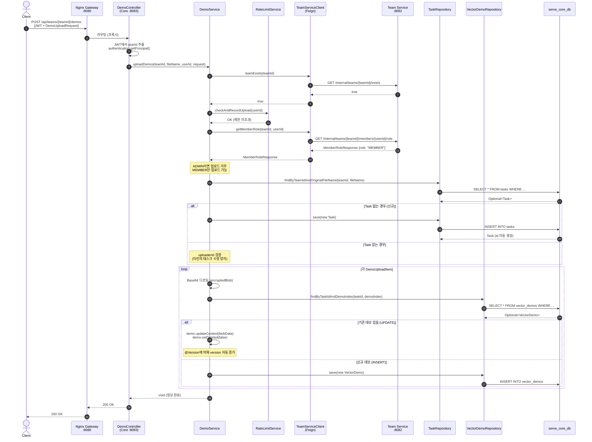
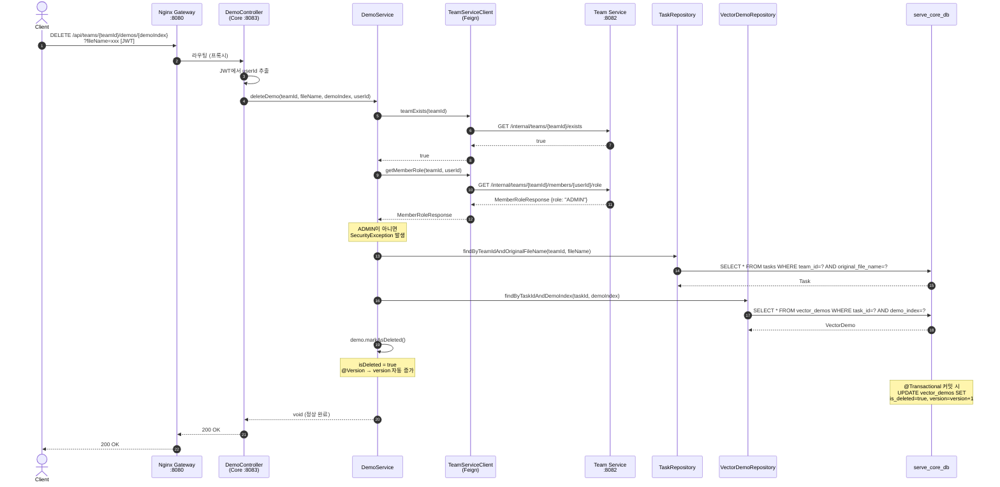
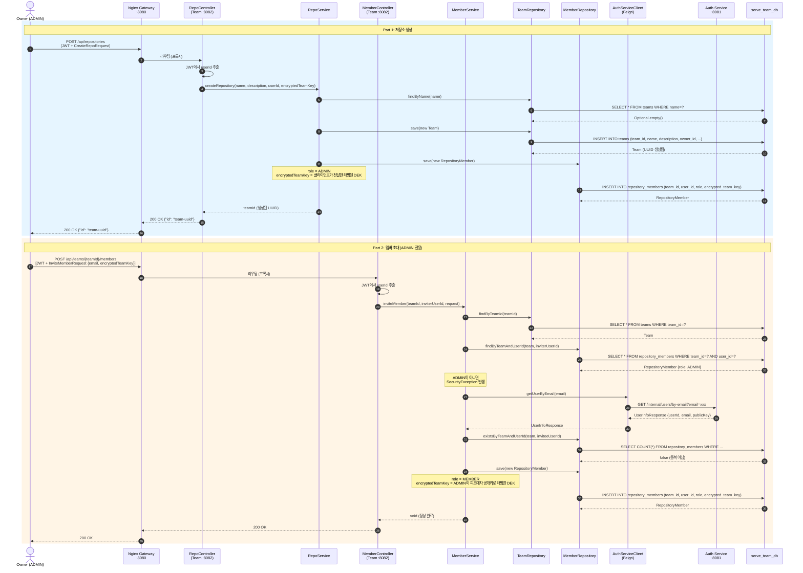

# SeRVe Server - MSA 아키텍처 보고서

## 1. 프로젝트 개요

**SeRVe (Secure Repository for Vector Embeddings)**는 Zero-Trust 기반 엣지 컴퓨팅 플랫폼의 백엔드 서버입니다.
로봇(Physical AI)이 수집한 데이터를 End-to-End 암호화하여 저장하고, 팀 단위로 안전하게 공유합니다.

기존 모놀리식(Monolithic) 아키텍처에서 **MSA(Microservices Architecture)**로 전환 완료되었으며,
하나의 레포지토리에서 관리되는 **Gradle 멀티모듈(Multi-Module)** 구조를 따릅니다.

| 항목 | 내용 |
|------|------|
| 언어 | Java 17 |
| 프레임워크 | Spring Boot 3.4.0, Spring Cloud 2024.0.0 |
| 데이터베이스 | MariaDB 11.4 (논리적 3개 스키마) |
| 암호화 | Google Tink 1.15.0 (AES-256-GCM / ECIES) |
| 인증 | JWT HS256 (24시간 만료) |
| 서비스 간 통신 | Spring Cloud OpenFeign |
| API Gateway | Nginx |
| 컨테이너화 | Docker Compose |

---

## 2. 시스템 아키텍처

```
클라이언트 (Python SDK / Streamlit)
        │
        ▼
   ┌─────────┐
   │  Nginx  │  :8080 (API Gateway)
   └────┬────┘
        │ URL 기반 라우팅
   ┌────┼──────────────┐
   ▼    ▼              ▼
 Auth  Team          Core
 :8081 :8082         :8083
   │    │              │
   ▼    ▼              ▼
 ┌──────────────────────┐
 │   MariaDB (RDS)      │
 │ ┌────┐┌────┐┌─────┐  │
 │ │auth││team││core │  │
 │ │_db ││_db ││_db  │  │
 │ └────┘└────┘└─────┘  │
 └──────────────────────┘
```

### 서비스 간 통신 흐름

```
Auth ◄── Team (사용자 정보 조회, 이메일로 사용자 검색)
Auth ◄── Core (사용자 존재 확인)
Team ◄── Auth (엣지노드 시리얼 조회 - 로봇 로그인)
Team ◄── Core (팀 존재 확인, 멤버 권한 조회, 엣지노드 팀 확인)
```

모든 서비스 간 통신은 `/internal/**` 경로를 통해 이루어지며, SecurityConfig에서 인증 없이 접근을 허용합니다.

---

## 3. 모듈 구조

```
SeRViS_server/
├── SeRVe-Common/          # 공통 모듈 (라이브러리, bootJar 없음)
├── SeRVe-Auth/            # 인증 서비스 (:8081)
├── SeRVe-Team/            # 팀/멤버 관리 서비스 (:8082)
├── SeRVe-Core/            # 태스크/데모/동기화 서비스 (:8083)
├── gateway/               # Nginx API Gateway 설정
├── docker/                # DB 초기화 스크립트
├── client-robot/          # Python 클라이언트 SDK
├── docker-compose.yml
├── build.gradle           # 루트 빌드 설정
└── settings.gradle        # 멀티모듈 선언
```

---

## 4. SeRVe-Common (공통 모듈)

모든 서비스가 의존하는 공유 라이브러리 모듈입니다. `java-library` 플러그인을 사용하여 JAR만 생성합니다.

### 4.1 패키지 구조

```
horizon.SeRVe.common/
├── dto/feign/
│   ├── UserInfoResponse.java          # 사용자 정보 (userId, email, publicKey)
│   ├── MemberRoleResponse.java        # 멤버 권한 (userId, teamId, role, encryptedTeamKey)
│   └── EdgeNodeAuthResponse.java      # 엣지노드 인증 정보
├── exception/
│   ├── GlobalExceptionHandler.java    # @RestControllerAdvice 공통 예외 처리
│   └── RateLimitExceededException.java # 429 Too Many Requests 예외
├── security/
│   ├── crypto/
│   │   ├── CryptoManager.java         # AES-256-GCM 암/복호화 유틸리티
│   │   └── KeyExchangeService.java    # ECIES 키 교환 서비스
│   └── jwt/
│       ├── JwtTokenProvider.java      # JWT 발급/검증 (HS256)
│       └── JwtAuthenticationFilter.java # JWT 인증 필터 (Team/Core용)
└── service/
    └── RateLimitService.java          # API 호출 제한 (100회/시간)
```

### 4.2 핵심 컴포넌트 상세

#### JwtTokenProvider

JWT 토큰의 발급과 검증을 담당합니다. Auth 서비스에서만 토큰을 발급하며, 다른 서비스는 공유된 Secret Key로 검증만 수행합니다.

| 메서드 | 설명 |
|--------|------|
| `createToken(userId, email)` | JWT 생성 (subject=email, claim=userId) |
| `getAuthentication(token)` | UsernamePasswordAuthenticationToken 반환 (principal=userId) |
| `resolveToken(request)` | Authorization 헤더에서 Bearer 토큰 추출 |
| `validateToken(token)` | 서명 및 만료 검증 |

**설계 포인트:** `getAuthentication()`은 DB 조회 없이 JWT claims만으로 Authentication 객체를 생성합니다. 이를 통해 Team/Core 서비스에서 UserDetailsService 없이 인증이 가능합니다.

#### CryptoManager

Google Tink 라이브러리를 사용한 대칭키 암호화 유틸리티입니다.

| 메서드 | 설명 |
|--------|------|
| `generateAesKey()` | AES-256-GCM 키 생성 |
| `encryptData(plainText, aesKey)` | 평문 → Base64 암호문 변환 |
| `decryptData(base64Ciphertext, aesKey)` | Base64 암호문 → 평문 복호화 |

#### KeyExchangeService

ECIES (Elliptic Curve Integrated Encryption Scheme) 기반 키 교환 서비스입니다.

| 메서드 | 설명 |
|--------|------|
| `generateClientKeyPair()` | ECIES P-256 키쌍 생성 |
| `getPublicKeyJson(privateKeyHandle)` | 공개키를 JSON 문자열로 내보내기 |
| `wrapAesKey(aesKey, clientPublicKeyJson)` | 클라이언트 공개키로 AES 키 래핑 (Envelope Encryption) |
| `unwrapAesKey(encryptedAesKey, clientPrivateKey)` | 래핑된 AES 키 복호화 |

#### RateLimitService

인메모리 기반 API 호출 제한 서비스입니다.

- **제한:** 사용자당 1시간에 100회 업로드
- **저장:** ConcurrentHashMap (서버 재시작 시 초기화)
- **적용:** DemoService의 `uploadDemos()` 메서드에서 사용

---

## 5. SeRVe-Auth (인증 서비스, :8081)

사용자 계정 관리, 회원가입, 로그인, JWT 발급을 담당합니다.

**DB:** `serve_auth_db`

### 5.1 패키지 구조

```
horizon.SeRVe.auth/
├── SeRVeAuthApplication.java          # @SpringBootApplication + @EnableFeignClients
├── config/
│   ├── SecurityConfig.java            # Spring Security 설정
│   └── AuthJwtAuthenticationFilter.java # Auth 전용 JWT 필터 (UserDetails 로드)
├── entity/
│   └── User.java                      # 사용자 엔티티 (implements UserDetails)
├── repository/
│   └── UserRepository.java            # JpaRepository<User, String>
├── service/
│   ├── AuthService.java               # 인증 비즈니스 로직
│   └── CustomUserDetailsService.java  # UserDetailsService 구현
├── controller/
│   ├── AuthController.java            # 인증 API (/auth/**)
│   └── InternalUserController.java    # 내부 API (/internal/users/**)
├── dto/
│   ├── SignupRequest.java
│   ├── LoginRequest.java
│   ├── LoginResponse.java
│   ├── PasswordResetRequest.java
│   └── RobotLoginRequest.java
└── feign/
    └── TeamServiceClient.java         # Team 서비스 호출용 Feign Client
```

### 5.2 User 엔티티

| 컬럼 | 타입 | 설명 |
|------|------|------|
| user_id | VARCHAR (PK) | UUID |
| email | VARCHAR (UNIQUE) | 이메일 |
| hashed_password | VARCHAR | BCrypt 해시 |
| public_key | TEXT | ECIES 공개키 (JSON) |
| encrypted_private_key | TEXT | 암호화된 개인키 (클라이언트 복구용) |

`User`는 Spring Security의 `UserDetails`를 구현하여 Auth 서비스의 `@AuthenticationPrincipal`에서 직접 사용됩니다.

### 5.3 인증 흐름

**Auth 전용 JWT 필터 (`AuthJwtAuthenticationFilter`):**
- Common의 `JwtAuthenticationFilter`와 달리, `UserDetailsService`를 통해 DB에서 전체 User 엔티티를 로드합니다.
- 이를 통해 Auth 컨트롤러에서 `@AuthenticationPrincipal User user`로 사용자 객체에 직접 접근할 수 있습니다.

```
[요청] → AuthJwtAuthenticationFilter
         │
         ├─ JWT 유효? → UserDetailsService.loadUserByUsername(email)
         │                  → DB에서 User 엔티티 로드
         │                  → SecurityContext에 User 설정
         │
         └─ JWT 무효? → 다음 필터로 전달 (인증 없음)
```

### 5.4 API 엔드포인트

| 메서드 | 경로 | 인증 | 설명 |
|--------|------|------|------|
| POST | `/auth/signup` | X | 회원가입 |
| POST | `/auth/login` | X | 로그인 → JWT 발급 |
| POST | `/auth/reset-password` | X | 비밀번호 재설정 |
| DELETE | `/auth/me` | O | 회원 탈퇴 |
| GET | `/auth/public-key?email=` | X | 사용자 공개키 조회 |
| POST | `/auth/robot/login` | X | 엣지노드(로봇) 로그인 |

**내부 API (서비스 간 통신용):**

| 메서드 | 경로 | 설명 |
|--------|------|------|
| GET | `/internal/users/{userId}` | 사용자 정보 조회 |
| GET | `/internal/users/by-email/{email}` | 이메일로 사용자 조회 |
| GET | `/internal/users/{userId}/exists` | 사용자 존재 여부 |
| GET | `/internal/users/{userId}/public-key` | 공개키 조회 |

### 5.5 로봇 로그인 로직

```
1. 클라이언트 → POST /auth/robot/login {serialNumber, apiToken}
2. Auth → TeamServiceClient.getEdgeNodeBySerial(serialNumber)
3. Team → EdgeNodeAuthResponse {nodeId, hashedToken, teamId, ...}
4. Auth: BCrypt.matches(apiToken, hashedToken) 검증
5. Auth → JWT 발급 (principal = nodeId)
```

### 5.6 Feign Client

| 대상 | 메서드 | 용도 |
|------|--------|------|
| Team (:8082) | `getEdgeNodeBySerial(serialNumber)` | 로봇 로그인 시 엣지노드 인증 정보 조회 |

---

## 6. SeRVe-Team (팀/멤버 관리 서비스, :8082)

팀(저장소) CRUD, 멤버 초대/강퇴/권한 관리, 엣지노드 등록을 담당합니다.

**DB:** `serve_team_db`

### 6.1 패키지 구조

```
horizon.SeRVe.team/
├── SeRVeTeamApplication.java
├── config/
│   └── SecurityConfig.java
├── entity/
│   ├── Team.java                      # 팀(저장소) 엔티티
│   ├── RepositoryMember.java          # 팀 멤버 엔티티 (복합키)
│   ├── RepositoryMemberId.java        # 복합키 (teamId + userId)
│   ├── EdgeNode.java                  # 엣지노드(로봇) 엔티티
│   ├── Role.java                      # ADMIN, MEMBER enum
│   └── RepoType.java                  # TEAM, PRIVATE enum
├── repository/
│   ├── TeamRepository.java
│   ├── MemberRepository.java
│   └── EdgeNodeRepository.java
├── service/
│   ├── RepoService.java               # 팀 CRUD 로직
│   ├── MemberService.java             # 멤버 관리 로직
│   └── EdgeNodeService.java           # 엣지노드 관리 로직
├── controller/
│   ├── RepoController.java            # 저장소 API
│   ├── MemberController.java          # 멤버 API
│   ├── EdgeNodeController.java        # 엣지노드 API
│   └── InternalTeamController.java    # 내부 API
├── dto/
│   ├── repo/
│   │   ├── CreateRepoRequest.java
│   │   ├── RepoResponse.java
│   │   └── UpdateRepoNameRequest.java
│   ├── member/
│   │   ├── InviteMemberRequest.java
│   │   ├── MemberResponse.java
│   │   ├── MemberKickResponse.java
│   │   ├── UpdateRoleRequest.java
│   │   └── UpdateTeamKeysRequest.java
│   └── edge/
│       └── RegisterEdgeNodeRequest.java
└── feign/
    └── AuthServiceClient.java         # Auth 서비스 호출용 Feign Client
```

### 6.2 DB 스키마

#### teams 테이블

| 컬럼 | 타입 | 설명 |
|------|------|------|
| team_id | VARCHAR (PK) | UUID |
| name | VARCHAR | 팀 이름 |
| description | VARCHAR(1000) | 설명 |
| owner_id | VARCHAR | 소유자 userId (String, JPA 참조 없음) |
| created_at | DATETIME | 생성일 |
| type | ENUM | TEAM 또는 PRIVATE |

#### repository_members 테이블

| 컬럼 | 타입 | 설명 |
|------|------|------|
| team_id | VARCHAR (복합 PK, FK) | 팀 ID |
| user_id | VARCHAR (복합 PK) | 사용자 ID |
| role | ENUM | ADMIN 또는 MEMBER |
| encrypted_team_key | TEXT | 이 멤버용으로 암호화된 팀 키 |

#### edge_nodes 테이블

| 컬럼 | 타입 | 설명 |
|------|------|------|
| node_id | VARCHAR (PK) | UUID |
| serial_number | VARCHAR (UNIQUE) | 시리얼 번호 |
| hashed_token | VARCHAR | BCrypt 해시된 API 토큰 |
| public_key | TEXT | ECIES 공개키 |
| encrypted_team_key | TEXT | 암호화된 팀 키 |
| team_id | VARCHAR (FK) | 소속 팀 |

### 6.3 핵심 설계: User JPA 참조 제거

MSA 전환의 핵심 변경 사항입니다. `RepositoryMember`에서 `@ManyToOne User user`를 제거하고 `String userId`로 대체했습니다.

**변경 전 (모놀리식):**
```java
@ManyToOne User user;  // DB JOIN 필요 → users 테이블이 같은 DB에 있어야 함
```

**변경 후 (MSA):**
```java
@Column(name = "user_id", insertable = false, updatable = false)
private String userId;  // 단순 문자열 → Feign으로 사용자 정보 조회
```

### 6.4 멤버 관리 로직

#### 멤버 초대 흐름
```
1. ADMIN이 이메일로 초대 요청
2. MemberService → AuthServiceClient.getUserByEmail(email)로 userId 조회
3. 이미 멤버인지 확인
4. RepositoryMember 생성 (encryptedTeamKey 포함)
```

#### 멤버 강퇴 후 키 로테이션
```
1. ADMIN이 멤버 강퇴 요청
2. 소유자는 강퇴 불가 (검증)
3. RepositoryMember 삭제
4. MemberKickResponse에 keyRotationRequired=true 반환
5. 클라이언트에서 rotateTeamKeys() 호출하여 남은 멤버들의 키 재암호화
```

### 6.5 API 엔드포인트

| 메서드 | 경로 | 인증 | 설명 |
|--------|------|------|------|
| POST | `/api/repositories` | O | 저장소 생성 |
| GET | `/api/repositories` | O | 내 저장소 목록 |
| GET | `/api/repositories/{teamId}/keys` | O | 팀 키 조회 |
| DELETE | `/api/repositories/{teamId}` | O | 저장소 삭제 (ADMIN) |
| POST | `/api/teams/{teamId}/members` | O | 멤버 초대 (ADMIN) |
| GET | `/api/teams/{teamId}/members` | O | 멤버 목록 |
| DELETE | `/api/teams/{teamId}/members/{userId}` | O | 멤버 강퇴 (ADMIN) |
| PUT | `/api/teams/{teamId}/members/{userId}` | O | 권한 변경 (ADMIN) |
| POST | `/api/teams/{teamId}/members/rotate-keys` | O | 키 로테이션 (ADMIN) |
| POST | `/edge-nodes/register` | X | 엣지노드 등록 |
| GET | `/edge-nodes/{nodeId}/team-key` | X | 엣지노드 팀 키 조회 |

**내부 API:**

| 메서드 | 경로 | 설명 |
|--------|------|------|
| GET | `/internal/teams/{teamId}/exists` | 팀 존재 여부 |
| GET | `/internal/teams/{teamId}/members/{userId}/role` | 멤버 권한 조회 |
| GET | `/internal/teams/{teamId}/members/{userId}/exists` | 멤버 존재 여부 |
| GET | `/internal/edge-nodes/by-serial/{serialNumber}` | 시리얼로 엣지노드 조회 |
| GET | `/internal/edge-nodes/{nodeId}/team-id` | 엣지노드 소속 팀 조회 |

### 6.6 Feign Client

| 대상 | 메서드 | 용도 |
|------|--------|------|
| Auth (:8081) | `getUserInfo(userId)` | 멤버 이메일 표시 |
| Auth (:8081) | `getUserByEmail(email)` | 멤버 초대 시 userId 조회 |
| Auth (:8081) | `userExists(userId)` | 사용자 존재 확인 |

---

## 7. SeRVe-Core (코어 데이터 서비스, :8083)

태스크(Task) 저장, 벡터 데모(Demo) 관리, 데이터 동기화, 보안 키 교환을 담당합니다.

**DB:** `serve_core_db`

### 7.1 패키지 구조

```
horizon.SeRVe.core/
├── SeRVeCoreApplication.java
├── config/
│   └── SecurityConfig.java
├── entity/
│   ├── Task.java                      # 태스크 엔티티 (메타데이터)
│   ├── EncryptedData.java             # 암호화 데이터 (1:1 with Task)
│   └── VectorDemo.java               # 벡터 데모 엔티티 (버전 관리)
├── repository/
│   ├── TaskRepository.java
│   ├── EncryptedDataRepository.java
│   └── VectorDemoRepository.java
├── service/
│   ├── TaskService.java               # 태스크 CRUD 로직
│   ├── DemoService.java               # 데모 업로드/동기화 로직
│   └── SyncService.java               # 태스크 동기화 로직
├── controller/
│   ├── TaskController.java            # 태스크 API
│   ├── DemoController.java            # 데모 API
│   ├── SyncController.java            # 동기화 API
│   └── SecurityController.java        # 키 교환 API
├── dto/
│   ├── task/
│   │   ├── UploadTaskRequest.java
│   │   ├── ClientUploadRequest.java   # 클라이언트 호환 DTO
│   │   ├── TaskResponse.java
│   │   └── EncryptedDataResponse.java
│   ├── demo/
│   │   ├── DemoUploadRequest.java
│   │   ├── DemoUploadItem.java
│   │   └── DemoSyncResponse.java
│   ├── sync/
│   │   └── ChangedTaskResponse.java
│   └── security/
│       ├── ClientPublicKeyRequest.java
│       └── ServerKeyResponse.java
└── feign/
    ├── TeamServiceClient.java
    └── AuthServiceClient.java
```

### 7.2 DB 스키마

#### tasks 테이블

| 컬럼 | 타입 | 설명 |
|------|------|------|
| id | BIGINT (PK, AUTO_INCREMENT) | DB PK (클라이언트 호환용 Long ID) |
| task_id | VARCHAR (UNIQUE) | 외부 식별용 UUID |
| team_id | VARCHAR | 소속 팀 ID |
| uploader_id | VARCHAR | 업로더 사용자 ID |
| original_file_name | VARCHAR | 원본 파일명 |
| file_type | VARCHAR | 파일 타입 |
| uploaded_at | DATETIME | 업로드 시각 |

#### encrypted_data 테이블

| 컬럼 | 타입 | 설명 |
|------|------|------|
| data_id | VARCHAR (PK) | UUID |
| task_id | VARCHAR (FK) | 연관 Task |
| encrypted_blob | LONGBLOB | 암호화된 바이너리 데이터 |
| version | INT | @Version (낙관적 잠금) |

#### vector_demos 테이블

| 컬럼 | 타입 | 설명 |
|------|------|------|
| demo_id | VARCHAR (PK) | UUID |
| task_id | VARCHAR (인덱스) | 소속 Task |
| team_id | VARCHAR (인덱스) | 소속 팀 |
| demo_index | INT | Task 내 순서 인덱스 |
| encrypted_blob | LONGBLOB | 암호화된 바이너리 데이터 |
| version | INT | @Version (낙관적 잠금) |
| is_deleted | BOOLEAN | 논리적 삭제 플래그 |
| created_at | DATETIME | 생성 시각 |
| updated_at | DATETIME | 수정 시각 |

**인덱스:**
- `idx_task_demo`: (task_id, demo_index)
- `idx_team_version`: (team_id, version)
- `idx_task_deleted`: (task_id, is_deleted)

### 7.3 엔티티 관계

```
Task (1) ──── (1) EncryptedData     메타데이터와 실제 데이터 분리
  │                                  (OneToOne, CascadeAll, OrphanRemoval)
  │
  └── taskId ──── VectorDemo (N)     하나의 Task에 여러 Demo 연결
                                     (JPA 참조 없음, String taskId로 연결)
```

**설계 이유:**
- Task는 메타데이터(파일명, 타입 등)만 보유
- EncryptedData는 실제 암호화 데이터(LONGBLOB)를 별도로 저장
- VectorDemo는 독립적인 버전 관리와 동기화가 필요하므로 별도 엔티티

### 7.4 역할 기반 접근 제어 (Federated Model)

```
┌─────────┐                    ┌─────────┐
│  ADMIN  │                    │ MEMBER  │
├─────────┤                    ├─────────┤
│ 태스크 업로드     ✅          │         ✗ │
│ 태스크 삭제       ✅          │         ✗ │
│ 데모 업로드       ✗          │         ✅ │
│ 데모 삭제         ✅          │         ✗ │
│ 데이터 조회       ✅          │         ✅ │
│ 동기화            ✅          │         ✅ │
└─────────┘                    └─────────┘
```

**핵심 원칙:** ADMIN은 Key Master 역할(암호화 키 관리, 태스크 구조 관리)을 수행하고, MEMBER는 실제 데이터(데모) 업로드를 담당합니다.

### 7.5 태스크 업로드 로직

#### 내부 API 업로드 (ADMIN 전용)
```
POST /api/teams/{teamId}/tasks

1. TeamServiceClient.teamExists(teamId) → 팀 존재 확인
2. TeamServiceClient.getMemberRole(teamId, userId) → ADMIN 권한 검증
3. Base64 디코딩 → byte[] blobData
4. 같은 이름 파일 존재 여부 확인:
   - [존재] → EncryptedData.updateContent(blobData) → Version 자동 증가
   - [없음] → Task + EncryptedData 신규 생성 (UUID 할당)
```

#### 클라이언트 호환 업로드
```
POST /api/tasks  (Body: {content, repositoryId})

1. 팀 존재 확인 + 멤버십 검증
2. Task 생성 (fileName="uploaded_task", fileType="encrypted")
3. EncryptedData 생성
4. 반환: Long id (DB Auto Increment PK)

※ Python 클라이언트가 doc_id = ''.join(filter(str.isdigit, str(data))) 로 파싱하므로
  Long 타입 반환이 필수
```

### 7.6 데모 업로드 로직 (MEMBER 전용)

```
POST /api/teams/{teamId}/demos

1. 팀 존재 확인
2. RateLimitService.checkAndRecordUpload(userId) → 호출 제한 체크
3. getMemberRole → ADMIN이면 거부 (MEMBER만 업로드 가능)
4. Task 조회 또는 생성:
   - [존재] → 업로더 본인인지 검증 (타인 태스크 수정 방지)
   - [없음] → 새 Task 자동 생성
5. 각 Demo 항목 처리:
   - [기존 존재] → updateContent(blobData), isDeleted=false 복원
   - [새로 생성] → VectorDemo 신규 생성 (version=0)
```

### 7.7 데이터 접근 권한 체크

`checkTaskPermission(task, requesterId)` 메서드는 사람(User)과 로봇(EdgeNode) 모두를 지원합니다.

```
1. AuthServiceClient.userExists(requesterId) → 사람인지 확인
   └─ [사람] → TeamServiceClient.memberExists(teamId, requesterId) → 멤버 여부 확인

2. 사람이 아니면 → TeamServiceClient.getEdgeNodeTeamId(requesterId)
   └─ [로봇] → edgeNodeTeamId == task.teamId 인지 확인

3. 둘 다 실패 → SecurityException("접근 권한이 없습니다")
```

### 7.8 동기화 (Sync) 메커니즘

#### 데모 동기화
```
GET /api/sync/demos?teamId={teamId}&lastVersion={version}

1. 팀 존재 + 멤버십 확인
2. VectorDemoRepository.findByTeamIdAndVersionGreaterThanOrderByVersionAsc()
3. Task ID 목록으로 IN 쿼리 → Task → Uploader Email 매핑 (N+1 방지)
4. DemoSyncResponse 리스트 반환 (createdBy 이메일 포함)
```

#### 태스크 동기화
```
GET /api/sync/tasks?teamId={teamId}&lastSyncVersion={version}

1. 팀 존재 확인
2. 전체 Task 조회 → EncryptedData.version > lastSyncVersion 필터링
3. ChangedTaskResponse 리스트 반환
※ 인증 불필요 (SecurityConfig에서 permitAll)
```

### 7.9 키 교환 (Handshake)

```
POST /api/security/handshake

1. 클라이언트 → {publicKeyJson} (ECIES P-256 공개키)
2. 서버: KeyExchangeService.generateAesKey() → 새 AES-256-GCM 키 생성
3. 서버: wrapAesKey(aesKey, publicKeyJson) → 클라이언트 공개키로 AES 키 래핑
4. 반환: {encryptedAesKey} (byte[])
5. 클라이언트: 자신의 개인키로 AES 키 복호화 → 데이터 암복호화에 사용
```

### 7.10 API 엔드포인트

| 메서드 | 경로 | 인증 | 설명 |
|--------|------|------|------|
| POST | `/api/security/handshake` | X | 키 교환 |
| POST | `/api/teams/{teamId}/tasks` | O | 태스크 업로드 (ADMIN) |
| POST | `/api/tasks` | O | 태스크 업로드 (클라이언트 호환) |
| GET | `/api/teams/{teamId}/tasks` | O | 태스크 목록 |
| GET | `/api/tasks/{id}/data` | O | 태스크 다운로드 (Long ID) |
| DELETE | `/api/teams/{teamId}/tasks/{taskId}` | O | 태스크 삭제 |
| POST | `/api/teams/{teamId}/demos` | O | 데모 업로드 (MEMBER) |
| DELETE | `/api/teams/{teamId}/demos/{demoIndex}` | O | 데모 삭제 (ADMIN) |
| GET | `/api/sync/demos` | O | 데모 동기화 |
| GET | `/api/sync/tasks` | X | 태스크 동기화 |

### 7.11 Feign Client

| 대상 | 메서드 | 용도 |
|------|--------|------|
| Team (:8082) | `teamExists(teamId)` | 팀 존재 확인 |
| Team (:8082) | `getMemberRole(teamId, userId)` | 멤버 권한 조회 |
| Team (:8082) | `memberExists(teamId, userId)` | 멤버 존재 확인 |
| Team (:8082) | `getEdgeNodeTeamId(nodeId)` | 엣지노드 소속 팀 |
| Auth (:8081) | `getUserInfo(userId)` | 사용자 정보 (동기화 시 이메일) |
| Auth (:8081) | `userExists(userId)` | 사용자 존재 확인 |

---

## 8. API Gateway (Nginx)

Nginx가 `localhost:8080`에서 URL 패턴별로 각 서비스에 라우팅합니다.

### 8.1 라우팅 규칙

| 경로 패턴 | 서비스 | 설명 |
|-----------|--------|------|
| `/auth/**` | Auth (:8081) | 인증 관련 |
| `/api/repositories` | Team (:8082) | 저장소 CRUD |
| `/api/teams/{id}/members/**` | Team (:8082) | 멤버 관리 |
| `/edge-nodes/**` | Team (:8082) | 엣지노드 관리 |
| `/api/teams/{id}/tasks` | Core (:8083) | 팀별 태스크 |
| `/api/tasks` | Core (:8083) | 태스크 업로드 |
| `/api/tasks/{id}/data` | Core (:8083) | 태스크 다운로드 |
| `/api/teams/{id}/demos` | Core (:8083) | 데모 관리 |
| `/api/security/**` | Core (:8083) | 키 교환 |
| `/api/sync/**` | Core (:8083) | 데이터 동기화 |

### 8.2 클라이언트 호환 Rewrite 규칙

기존 Python 클라이언트와의 하위 호환성을 위한 URL 재작성 규칙입니다.

| 클라이언트 요청 | 실제 라우팅 | 설명 |
|----------------|------------|------|
| `/repositories/{id}/members` | `/api/teams/{id}/members` | 멤버 API 호환 |
| `/api/documents` | `/api/tasks` | 태스크 업로드 호환 |
| `/api/documents/{id}` | `/api/tasks/{id}/data` | 태스크 다운로드 호환 |
| `/api/tasks/{id}` | `/api/tasks/{id}/data` | data 경로 자동 추가 |

---

## 9. 보안 아키텍처

### 9.1 Zero-Trust 원칙

서버는 평문 데이터나 사용자 개인키를 절대 보유하지 않습니다.

```
[클라이언트]                          [서버]
  │                                    │
  ├── 키 생성 (ECIES P-256)            │
  ├── 공개키 전송 ──────────────────→ 공개키 저장 (users.public_key)
  ├── 개인키 암호화 후 전송 ─────────→ 암호화된 개인키 저장
  │                                    │ (users.encrypted_private_key)
  │                                    │ ※ 서버는 복호화 불가
  │                                    │
  ├── 핸드셰이크 요청 ──────────────→ AES 키 생성
  ├── 래핑된 AES 키 수신 ◄──────────── AES 키를 공개키로 래핑
  ├── 개인키로 AES 키 복호화           │
  │                                    │
  ├── 데이터 AES 암호화                │
  ├── 암호화 데이터 업로드 ──────────→ 암호화 상태로 저장 (LONGBLOB)
  │                                    │ ※ 서버는 복호화 불가
```

### 9.2 Envelope Encryption (팀 키 관리)

```
팀 키(DEK) → 멤버별 공개키(KEK)로 래핑 → encrypted_team_key 저장

멤버 A: encrypt(teamKey, A의 publicKey) → A의 encrypted_team_key
멤버 B: encrypt(teamKey, B의 publicKey) → B의 encrypted_team_key
로봇 C: encrypt(teamKey, C의 publicKey) → C의 encrypted_team_key

※ 멤버 강퇴 시 키 로테이션 필요
  → 새 팀 키 생성 → 남은 멤버들의 encrypted_team_key 재암호화
```

### 9.3 보안 계층 요약

| 계층 | 기술 | 목적 |
|------|------|------|
| 인증 | JWT HS256 (24시간) | 사용자/로봇 신원 확인 |
| 비밀번호 | BCrypt (10 rounds) | 패스워드 안전 저장 |
| 키 교환 | ECIES P-256 | 비대칭 키 교환 |
| 데이터 암호화 | AES-256-GCM | 대칭키 데이터 암호화 |
| 접근 제어 | ADMIN/MEMBER 역할 | 기능별 권한 분리 |
| 호출 제한 | RateLimitService | DDoS 방지 (100회/시간) |
| 동시성 제어 | @Version (낙관적 잠금) | 동시 수정 충돌 방지 |

---

## 10. 테스트

### 10.1 테스트 파일 목록

| 모듈 | 파일 | 유형 | 테스트 내용 |
|------|------|------|------------|
| Common | `CryptoTest.java` | 단위 | AES/ECIES 암복호화 검증 |
| Auth | `AuthServiceTest.java` | 단위 (Mockito) | 회원가입, 로그인, 비밀번호 재설정 |
| Auth | `AuthControllerTest.java` | 단위 (Mockito) | 컨트롤러 엔드포인트 |
| Auth | `ClientCompatibilityTest.java` | 단위 | Python 클라이언트 호환성 |
| Team | `MemberServiceTest.java` | 단위 (Mockito) | 멤버 초대, 강퇴, 권한 변경 |
| Team | `ClientCompatibilityTest.java` | 단위 | 클라이언트 호환성 |
| Core | `TaskServiceTest.java` | 단위 (Mockito) | 태스크 업로드, 조회, 권한 검증 |
| Core | `ClientCompatibilityTest.java` | 단위 | DTO 직렬화, Long ID 호환성 |

### 10.2 테스트 전략

- **프레임워크:** JUnit 5 + Mockito (`@ExtendWith(MockitoExtension.class)`)
- **Feign Client:** `@Mock`으로 모킹 (실제 서비스 호출 없음)
- **DB:** 테스트 시 H2 인메모리 DB 사용 가능 (각 모듈 test dependencies에 H2 포함)
- **클라이언트 호환성:** Jackson ObjectMapper로 JSON 직렬화/역직렬화 검증

---

## 11. 인프라 구성

### 11.1 Docker Compose

```yaml
services:
  mariadb:
    image: mariadb:11.4
    port: 3306
    volumes: ./docker/init-db.sql → /docker-entrypoint-initdb.d/
    # 3개 스키마 자동 생성

  gateway:
    image: nginx:alpine
    port: 8080
    volumes: ./gateway/nginx.conf → /etc/nginx/conf.d/default.conf
    # URL 기반 라우팅
```

### 11.2 DB 초기화

```sql
CREATE DATABASE IF NOT EXISTS serve_auth_db;
CREATE DATABASE IF NOT EXISTS serve_team_db;
CREATE DATABASE IF NOT EXISTS serve_core_db;
GRANT ALL PRIVILEGES ON serve_*.* TO 'serve_user'@'%';
```

물리적으로는 하나의 MariaDB 인스턴스를 사용하지만, 논리적으로 3개의 독립 스키마로 분리하여 각 서비스의 데이터 독립성을 보장합니다.

### 11.3 빌드 및 실행

```bash
# 전체 빌드
./gradlew build

# Docker 인프라 실행
docker-compose up -d mariadb gateway

# 각 서비스 실행 (별도 터미널)
./gradlew :SeRVe-Auth:bootRun    # http://localhost:8081
./gradlew :SeRVe-Team:bootRun    # http://localhost:8082
./gradlew :SeRVe-Core:bootRun    # http://localhost:8083

# 클라이언트 접속: http://localhost:8080 (Nginx Gateway)
```

---

## 12. 도메인 리네이밍 이력

프로젝트가 텍스트 기반 RAG 챗봇에서 로봇 시스템 배포로 발전하면서, 도메인 용어를 변경했습니다.

| 기존 | 변경 | 이유 |
|------|------|------|
| Document | Task | 로봇에게 배포하는 "태스크" 개념 |
| Chunk | Demo | 태스크의 "데모 데이터" 개념 |
| documents (테이블) | tasks | DB 스키마 일치 |
| vector_chunks (테이블) | vector_demos | DB 스키마 일치 |
| /api/documents | /api/tasks | URL 경로 |
| /api/chunks | /api/demos | URL 경로 |

클라이언트 하위 호환성을 위해 Nginx에서 `/api/documents` → `/api/tasks` rewrite 규칙을 유지합니다.

---

## 13. MSA 전환으로 인한 로직 변경 상세

모놀리식에서 MSA로 전환하면서 불가피하게 변경된 로직, 새로 추가된 클래스/메서드, 설계 패턴 변경을 정리합니다.

### 13.1 변경 요약 테이블

| 분류 | 모놀리식 | MSA | 변경 사유 |
|------|---------|-----|----------|
| JWT 인증 Principal | `User` 객체 (전체 엔티티) | `String userId` | 다른 서비스에 users 테이블 없음 |
| JWT `getAuthentication()` | `UserDetailsService`로 DB 조회 | JWT claims만으로 생성 | Auth 외 서비스에서 DB 조회 불가 |
| JWT 필터 | 전역 단일 필터 | 서비스별 필터 분리 | Auth만 full User 로드 필요 |
| 엔티티 참조 | `@ManyToOne User` JPA 관계 | `String userId` 문자열 | 서로 다른 DB 스키마 |
| 데이터 조회 | 직접 Repository 호출 | Feign Client 호출 | 서비스 간 DB 격리 |
| DTO 생성 | JPA로 로드된 연관 엔티티 사용 | 외부에서 파라미터로 주입 | 연관 엔티티 접근 불가 |
| 내부 API | 불필요 | `/internal/**` 엔드포인트 신규 | 서비스 간 데이터 노출 |
| 컨트롤러 인증 | `@AuthenticationPrincipal User` | `Authentication` + `getPrincipal()` | Auth만 User 객체 보유 |
| 권한 검증 | 직접 DB 쿼리 | TeamServiceClient Feign 호출 | Team DB에 직접 접근 불가 |

### 13.2 JWT 인증 체계 변경

#### 변경 전 (모놀리식)
```java
// JwtTokenProvider.getAuthentication() - 모놀리식
public Authentication getAuthentication(String token) {
    String email = getUserEmail(token);
    UserDetails userDetails = userDetailsService.loadUserByUsername(email);
    return new UsernamePasswordAuthenticationToken(userDetails, "", userDetails.getAuthorities());
    // Principal = User 객체 (DB에서 로드)
}
```

모든 컨트롤러에서 `@AuthenticationPrincipal User user`로 사용자 엔티티에 바로 접근 가능했습니다.

#### 변경 후 (MSA)

**Common 모듈의 JwtTokenProvider (Team/Core용):**
```java
// DB 조회 없이 JWT claims만으로 Authentication 생성
public Authentication getAuthentication(String token) {
    String email = getUserEmail(token);
    String userId = getUserId(token);
    List<GrantedAuthority> authorities = List.of(new SimpleGrantedAuthority("ROLE_USER"));
    UsernamePasswordAuthenticationToken auth =
        new UsernamePasswordAuthenticationToken(userId, null, authorities);
    auth.setDetails(Map.of("email", email, "userId", userId));
    return auth;
    // Principal = String userId (DB 조회 없음)
}
```

**Auth 전용 AuthJwtAuthenticationFilter (신규 클래스):**
```java
// Auth 서비스만 UserDetailsService로 full User 로드
String email = jwtTokenProvider.getUserEmail(token);
UserDetails userDetails = userDetailsService.loadUserByUsername(email);
UsernamePasswordAuthenticationToken auth =
    new UsernamePasswordAuthenticationToken(userDetails, "", userDetails.getAuthorities());
// Principal = User 객체 (Auth DB에서 로드)
```

**변경 사유:** Team/Core 서비스에는 `users` 테이블이 없으므로 `UserDetailsService`를 사용할 수 없습니다. Common의 `JwtTokenProvider`는 DB 조회 없이 JWT claims만으로 인증 객체를 생성하도록 변경했고, Auth 서비스만 별도의 `AuthJwtAuthenticationFilter`를 통해 full User를 로드합니다.

### 13.3 컨트롤러 인증 패턴 변경

#### 변경 전 (모놀리식) — 모든 컨트롤러
```java
@GetMapping("/api/teams/{teamId}/members")
public ResponseEntity<?> getMembers(
        @PathVariable String teamId,
        @AuthenticationPrincipal User user) {    // User 객체 직접 접근

    memberService.getMembers(teamId, user);      // User 엔티티 전달
}
```

#### 변경 후 (MSA) — Team/Core 컨트롤러
```java
@GetMapping("/api/teams/{teamId}/members")
public ResponseEntity<?> getMembers(
        @PathVariable String teamId,
        Authentication authentication) {          // Authentication 객체로 변경

    String userId = (String) authentication.getPrincipal();  // userId String 추출
    memberService.getMembers(teamId, userId);                // userId String 전달
}
```

**영향 범위:** Team 서비스의 `MemberController`, `RepoController` 및 Core 서비스의 `TaskController`, `DemoController`의 모든 엔드포인트 메서드가 이 패턴으로 변경되었습니다.

### 13.4 JPA 엔티티 참조 제거

#### RepositoryMember (Team 서비스)

**변경 전:**
```java
@ManyToOne
@MapsId("userId")
private User user;  // Auth DB의 users 테이블과 JPA 관계
```

**변경 후:**
```java
@Column(name = "user_id", insertable = false, updatable = false)
private String userId;  // 단순 문자열 ID (Feign으로 사용자 정보 조회)
```

#### Task (Core 서비스, 구 Document)

**변경 전:**
```java
@ManyToOne
@JoinColumn(name = "team_id")
private Team team;        // Team DB의 teams 테이블과 JPA 관계

@ManyToOne
@JoinColumn(name = "uploader_id")
private User uploader;    // Auth DB의 users 테이블과 JPA 관계
```

**변경 후:**
```java
@Column(name = "team_id")
private String teamId;      // 단순 문자열 ID

@Column(name = "uploader_id")
private String uploaderId;  // 단순 문자열 ID
```

**변경 사유:** MSA에서는 각 서비스가 독립된 DB 스키마를 사용하므로, 다른 서비스의 테이블에 대한 JPA `@ManyToOne` 외래키 관계를 유지할 수 없습니다.

#### EdgeNode (Team 서비스)

**변경 전:** `implements UserDetails` (Spring Security principal로 사용)

**변경 후:** `UserDetails` 인터페이스 제거. 엣지노드 인증은 Auth 서비스에서 JWT로 처리하므로, Team 서비스의 EdgeNode는 더 이상 Security principal이 아닙니다.

### 13.5 Repository 쿼리 메서드 시그니처 변경

#### MemberRepository (Team 서비스)

| 변경 전 (모놀리식) | 변경 후 (MSA) |
|-------------------|--------------|
| `findAllByUser(User user)` | `findAllByUserId(String userId)` |
| `findByTeamAndUser(Team, User)` | `findByTeamAndUserId(Team, String)` |
| `existsByTeamAndUser(Team, User)` | `existsByTeamAndUserId(Team, String)` |

#### TaskRepository (Core 서비스, 구 DocumentRepository)

| 변경 전 (모놀리식) | 변경 후 (MSA) |
|-------------------|--------------|
| `findAllByTeam(Team team)` | `findAllByTeamId(String teamId)` |
| `findByTeamAndOriginalFileName(Team, String)` | `findByTeamIdAndOriginalFileName(String, String)` |

#### EncryptedDataRepository (Core 서비스)

| 변경 전 | 변경 후 |
|---------|--------|
| `findByDocument(Document)` | `findByTask(Task)` |

**변경 사유:** JPA 엔티티 참조가 문자열 ID로 바뀌었으므로, Repository의 Spring Data JPA 쿼리 메서드도 엔티티 파라미터 대신 String 파라미터를 사용하도록 변경되었습니다.

### 13.6 서비스 로직의 Feign Client 전환

#### 직접 Repository 호출 → Feign Client 호출

**MemberService.inviteMember() (Team 서비스)**

| 변경 전 | 변경 후 |
|---------|--------|
| `userRepository.findByEmail(email)` | `authServiceClient.getUserByEmail(email)` |
| `User invitee = ...` | `UserInfoResponse inviteeInfo = ...` |
| `member.setUser(invitee)` | `memberId = new RepositoryMemberId(teamId, inviteeInfo.getUserId())` |

**TaskService.uploadTask() (Core 서비스)**

| 변경 전 | 변경 후 |
|---------|--------|
| `teamRepository.findById(teamId)` | `teamServiceClient.teamExists(teamId)` |
| `memberRepository.findByTeamAndUser(team, user)` | `teamServiceClient.getMemberRole(teamId, userId)` |
| `document.setTeam(team)` | `task.setTeamId(teamId)` (String) |
| `document.setUploader(user)` | `task.setUploaderId(userId)` (String) |

**TaskService.checkTaskPermission() (Core 서비스)**

| 변경 전 | 변경 후 |
|---------|--------|
| `memberRepository.existsByTeamAndUser(team, user)` | `authServiceClient.userExists(id)` + `teamServiceClient.memberExists(teamId, id)` |
| `edgeNodeRepository.findById(id)` | `teamServiceClient.getEdgeNodeTeamId(id)` |

**AuthService.robotLogin() (Auth 서비스)**

| 변경 전 | 변경 후 |
|---------|--------|
| `edgeNodeRepository.findBySerialNumber(serial)` | `teamServiceClient.getEdgeNodeBySerial(serial)` |
| `EdgeNode robot = ...` | `EdgeNodeAuthResponse robot = ...` |

### 13.7 DTO 팩토리 메서드 시그니처 변경

JPA 연관 엔티티에서 직접 가져오던 정보(특히 이메일)를 외부 파라미터로 주입받도록 변경되었습니다.

#### MemberResponse (Team 서비스)

**변경 전:**
```java
public static MemberResponse from(RepositoryMember member) {
    return MemberResponse.builder()
        .email(member.getUser().getEmail())   // JPA로 로드된 User에서 이메일 획득
        .build();
}
```

**변경 후:**
```java
public static MemberResponse from(RepositoryMember member, String email) {
    return MemberResponse.builder()
        .email(email)   // Feign으로 조회한 이메일을 파라미터로 주입
        .build();
}
```

#### RepoResponse (Team 서비스)

**변경 전:**
```java
public static RepoResponse of(Team team, User owner) {
    return RepoResponse.builder()
        .ownerEmail(owner.getEmail())
        .build();
}
```

**변경 후:**
```java
public static RepoResponse of(Team team, String ownerEmail) {
    return RepoResponse.builder()
        .ownerEmail(ownerEmail)   // Feign으로 조회한 이메일을 파라미터로 주입
        .build();
}
```

### 13.8 신규 생성된 클래스/컴포넌트

MSA 전환을 위해 완전히 새로 작성된 클래스들입니다.

#### 신규 Internal API 컨트롤러 (2개)

서비스 간 데이터 교환을 위해 `/internal/**` 경로의 REST API를 새로 노출합니다.

**InternalUserController (Auth 서비스)**
| 메서드 | 호출 서비스 | 용도 |
|--------|-----------|------|
| `GET /internal/users/{userId}` | Team, Core | 사용자 정보 조회 |
| `GET /internal/users/by-email/{email}` | Team | 멤버 초대 시 userId 조회 |
| `GET /internal/users/{userId}/exists` | Core | 권한 체크 시 사용자 존재 확인 |
| `GET /internal/users/{userId}/public-key` | Team | 공개키 조회 |

**InternalTeamController (Team 서비스)**
| 메서드 | 호출 서비스 | 용도 |
|--------|-----------|------|
| `GET /internal/teams/{teamId}/exists` | Core | 팀 존재 확인 |
| `GET /internal/teams/{teamId}/members/{userId}/role` | Core | 멤버 권한 조회 |
| `GET /internal/teams/{teamId}/members/{userId}/exists` | Core | 멤버 존재 확인 |
| `GET /internal/edge-nodes/by-serial/{serial}` | Auth | 로봇 로그인 시 엣지노드 조회 |
| `GET /internal/edge-nodes/{nodeId}/team-id` | Core | 엣지노드 소속 팀 확인 |

#### 신규 Feign Client 인터페이스 (4개)

| 위치 | 대상 | 메서드 수 |
|------|------|----------|
| Auth → Team | `TeamServiceClient` | 1개 (`getEdgeNodeBySerial`) |
| Team → Auth | `AuthServiceClient` | 3개 (`getUserInfo`, `getUserByEmail`, `userExists`) |
| Core → Team | `TeamServiceClient` | 4개 (`teamExists`, `getMemberRole`, `memberExists`, `getEdgeNodeTeamId`) |
| Core → Auth | `AuthServiceClient` | 2개 (`getUserInfo`, `userExists`) |

#### 신규 Auth 전용 JWT 필터 (1개)

`AuthJwtAuthenticationFilter` — Auth 서비스에서만 사용되는 JWT 인증 필터. `UserDetailsService`를 통해 DB에서 full User 엔티티를 로드하여 `@AuthenticationPrincipal User`를 유지합니다.

#### 신규 공유 DTO (3개)

Feign 통신용으로 Common 모듈에 추가된 DTO입니다.

| DTO | 필드 | 용도 |
|-----|------|------|
| `UserInfoResponse` | userId, email, publicKey | 사용자 정보 전달 |
| `MemberRoleResponse` | userId, teamId, role, encryptedTeamKey | 멤버 권한 전달 |
| `EdgeNodeAuthResponse` | nodeId, serialNumber, hashedToken, publicKey, encryptedTeamKey, teamId | 엣지노드 인증 정보 전달 |

### 13.9 성능 영향: N+1 Feign 호출

MSA 전환으로 인해 일부 로직에서 N+1 형태의 Feign 호출이 발생합니다.

#### 영향받는 메서드

| 서비스 | 메서드 | 패턴 | 대응 |
|--------|--------|------|------|
| Team | `MemberService.getMembers()` | 멤버 수만큼 `getUserInfo()` Feign 호출 | try-catch로 실패 시 "Unknown" 폴백 |
| Team | `RepoService.getMyRepos()` | 저장소 수만큼 `getUserInfo()` Feign 호출 | 동일 |
| Core | `DemoService.syncTeamDemos()` | Task 수만큼 `getUserInfo()` Feign 호출 | IN 쿼리로 Task 조회 후 Map 구성 |

**Core 서비스의 N+1 최적화:**
```java
// Task ID → Uploader Email 매핑을 미리 구성 (IN 쿼리 사용)
List<String> taskIds = demos.stream().map(VectorDemo::getTaskId).distinct().collect(...);
Map<String, String> taskUploaderMap = taskRepository.findAllByTaskIdIn(taskIds)
    .stream()
    .collect(Collectors.toMap(Task::getTaskId, task -> {
        try {
            return authServiceClient.getUserInfo(task.getUploaderId()).getEmail();
        } catch (Exception e) {
            return "unknown";
        }
    }));
```

DB 쿼리는 IN 절로 최적화했지만, Feign 호출은 여전히 Task 업로더 수만큼 발생합니다. 향후 Resilience4j 서킷브레이커나 배치 API를 통해 개선할 수 있습니다.

### 13.10 SecurityConfig 변경

각 서비스별로 독립된 SecurityConfig가 필요해졌으며, 허용 경로와 JWT 필터가 다릅니다.

| 서비스 | permitAll 경로 | JWT 필터 |
|--------|---------------|---------|
| Auth | `/auth/**`, `/internal/**` | `AuthJwtAuthenticationFilter` (full User 로드) |
| Team | `/internal/**`, `/edge-nodes/register` | `JwtAuthenticationFilter` (Common, userId String) |
| Core | `/api/security/**`, `/api/sync/tasks`, `/internal/**` | `JwtAuthenticationFilter` (Common, userId String) |

---

## 14. ERD (Entity-Relationship Diagram)

3개의 논리적 데이터베이스에 걸친 전체 테이블 구조입니다. MSA 특성상 서비스 간 FK 참조는 없으며, `userId`/`teamId` 등의 String 필드로 논리적으로 연결됩니다.

```mermaid
erDiagram
    %% ========== serve_auth_db ==========
    users {
        VARCHAR user_id PK "UUID"
        VARCHAR email UK "UNIQUE"
        VARCHAR hashed_password "NOT NULL"
        TEXT public_key "NOT NULL, ECIES 공개키"
        TEXT encrypted_private_key "NOT NULL, 암호화된 개인키"
    }

    %% ========== serve_team_db ==========
    teams {
        VARCHAR team_id PK "UUID"
        VARCHAR name "NOT NULL"
        VARCHAR description "MAX 1000"
        VARCHAR owner_id "사용자 UUID (논리적 FK → users)"
        DATETIME created_at ""
        ENUM type "TEAM"
    }

    repository_members {
        VARCHAR team_id PK_FK "복합 PK, FK → teams"
        VARCHAR user_id PK "복합 PK (논리적 FK → users)"
        ENUM role "ADMIN | MEMBER"
        TEXT encrypted_team_key "NOT NULL, 래핑된 팀 DEK"
    }

    edge_nodes {
        VARCHAR node_id PK "UUID"
        VARCHAR serial_number UK "UNIQUE"
        VARCHAR hashed_token "NOT NULL"
        TEXT public_key "NOT NULL"
        TEXT encrypted_team_key "래핑된 팀 DEK"
        VARCHAR team_id FK "FK → teams"
    }

    teams ||--o{ repository_members : "has members"
    teams ||--o{ edge_nodes : "has edge nodes"

    %% ========== serve_core_db ==========
    tasks {
        BIGINT id PK "AUTO_INCREMENT"
        VARCHAR task_id UK "UUID, UNIQUE"
        VARCHAR team_id "논리적 FK → teams"
        VARCHAR uploader_id "논리적 FK → users"
        VARCHAR original_file_name ""
        VARCHAR file_type ""
        DATETIME uploaded_at ""
    }

    encrypted_data {
        VARCHAR data_id PK "UUID"
        BIGINT task_id FK "FK → tasks.id"
        LONGBLOB encrypted_blob "NOT NULL, 암호화 데이터"
        INT version "낙관적 잠금"
    }

    vector_demos {
        VARCHAR demo_id PK "UUID (36)"
        VARCHAR task_id "논리적 FK → tasks.task_id"
        VARCHAR team_id "논리적 FK → teams"
        INT demo_index "NOT NULL"
        LONGBLOB encrypted_blob "NOT NULL, 암호화 벡터"
        INT version "낙관적 잠금, @Version"
        BOOLEAN is_deleted "논리적 삭제 플래그"
        DATETIME created_at ""
        DATETIME updated_at ""
    }

    tasks ||--o| encrypted_data : "1:1 암호화 데이터"
    tasks ||--o{ vector_demos : "1:N 벡터 데모 (task_id)"
```

### DB별 테이블 요약

| 데이터베이스 | 테이블 | 설명 |
|-------------|--------|------|
| `serve_auth_db` | `users` | 사용자 계정 (인증정보 + 공개키/암호화된 개인키) |
| `serve_team_db` | `teams` | 팀(저장소) 메타데이터 |
| `serve_team_db` | `repository_members` | 팀-사용자 매핑 (복합 PK, 역할 + 래핑된 팀키) |
| `serve_team_db` | `edge_nodes` | 로봇(엣지노드) 등록 정보 |
| `serve_core_db` | `tasks` | 태스크 메타데이터 (파일명, 업로더, 팀) |
| `serve_core_db` | `encrypted_data` | 태스크의 암호화된 바이너리 데이터 (1:1) |
| `serve_core_db` | `vector_demos` | 벡터 임베딩 데모 데이터 (버전 관리 + 논리적 삭제) |

---

## 15. 클래스 다이어그램 (Class Diagram)

서비스 계층 중심의 클래스 관계도입니다. 각 MSA 모듈별 Controller → Service → Repository → Entity 구조와 Feign Client를 통한 서비스 간 의존관계를 보여줍니다.

```mermaid
classDiagram
    direction TB

    %% ========== SeRVe-Auth ==========
    namespace Auth_Service_8081 {
        class AuthController {
            +register(RegisterRequest) ResponseEntity
            +login(LoginRequest) ResponseEntity
            +resetPassword(ResetPasswordRequest) ResponseEntity
        }
        class AuthService {
            -UserRepository userRepository
            -JwtTokenProvider jwtTokenProvider
            +register(RegisterRequest) void
            +login(LoginRequest) LoginResponse
            +resetPassword(ResetPasswordRequest) void
        }
        class UserRepository {
            <<interface>>
            +findByEmail(String) Optional~User~
            +findByUserId(String) Optional~User~
        }
        class User {
            -String userId
            -String email
            -String hashedPassword
            -String publicKey
            -String encryptedPrivateKey
        }
        class AuthInternalController {
            +getUserInfo(String) UserInfoResponse
            +getUserByEmail(String) UserInfoResponse
            +userExists(String) boolean
        }
    }

    AuthController --> AuthService
    AuthService --> UserRepository
    UserRepository --> User
    AuthInternalController --> AuthService

    %% ========== SeRVe-Team ==========
    namespace Team_Service_8082 {
        class RepoController {
            +createRepository(CreateRepoRequest) ResponseEntity
            +getRepositories() ResponseEntity
            +deleteRepository(String) ResponseEntity
        }
        class MemberController {
            +inviteMember(String, InviteMemberRequest) ResponseEntity
            +getMembers(String) ResponseEntity
            +kickMember(String, String) ResponseEntity
        }
        class RepoService {
            -TeamRepository teamRepository
            -MemberRepository memberRepository
            -AuthServiceClient authServiceClient
            +createRepository(String, String, String, String) String
            +getMyRepos(String) List~RepoResponse~
            +deleteRepo(String, String) void
        }
        class MemberService {
            -MemberRepository memberRepository
            -TeamRepository teamRepository
            -AuthServiceClient authServiceClient
            +inviteMember(String, String, InviteMemberRequest) void
            +getMembers(String, String) List~MemberResponse~
            +kickMember(String, String, String) MemberKickResponse
        }
        class TeamRepository {
            <<interface>>
            +findByTeamId(String) Optional~Team~
            +findByName(String) Optional~Team~
        }
        class MemberRepository {
            <<interface>>
            +findByTeamAndUserId(Team, String) Optional~RepositoryMember~
            +findAllByTeam(Team) List~RepositoryMember~
            +existsByTeamAndUserId(Team, String) boolean
        }
        class Team {
            -String teamId
            -String name
            -String description
            -String ownerId
        }
        class RepositoryMember {
            -RepositoryMemberId id
            -Team team
            -Role role
            -String encryptedTeamKey
        }
        class Team_AuthServiceClient {
            <<FeignClient>>
            +getUserInfo(String) UserInfoResponse
            +getUserByEmail(String) UserInfoResponse
        }
        class TeamInternalController {
            +teamExists(String) boolean
            +memberExists(String, String) boolean
            +getMemberRole(String, String) MemberRoleResponse
        }
    }

    RepoController --> RepoService
    MemberController --> MemberService
    RepoService --> TeamRepository
    RepoService --> MemberRepository
    RepoService --> Team_AuthServiceClient
    MemberService --> TeamRepository
    MemberService --> MemberRepository
    MemberService --> Team_AuthServiceClient
    TeamRepository --> Team
    MemberRepository --> RepositoryMember
    RepositoryMember --> Team
    TeamInternalController --> RepoService
    TeamInternalController --> MemberService

    %% ========== SeRVe-Core ==========
    namespace Core_Service_8083 {
        class TaskController {
            +uploadTask(String, UploadTaskRequest) ResponseEntity
            +getTasks(String) ResponseEntity
            +getDataById(Long) ResponseEntity
            +deleteTask(String, String) ResponseEntity
        }
        class DemoController {
            +uploadDemos(String, DemoUploadRequest) ResponseEntity
            +deleteDemo(String, int, String) ResponseEntity
            +syncTeamDemos(String, int) ResponseEntity
        }
        class SyncController {
            +getChangedTasks(String, String) ResponseEntity
        }
        class TaskService {
            -TaskRepository taskRepository
            -EncryptedDataRepository encDataRepo
            -TeamServiceClient teamServiceClient
            -AuthServiceClient authServiceClient
            +uploadTask(String, String, UploadTaskRequest) Long
            +getTasks(String, String) List~TaskResponse~
            +getDataById(Long, String) EncryptedDataResponse
            +deleteTask(String, String, String) void
        }
        class DemoService {
            -VectorDemoRepository vectorDemoRepository
            -TaskRepository taskRepository
            -TeamServiceClient teamServiceClient
            -RateLimitService rateLimitService
            +uploadDemos(String, String, String, DemoUploadRequest) void
            +deleteDemo(String, String, int, String) void
            +syncTeamDemos(String, int, String) List~DemoSyncResponse~
        }
        class SyncService {
            -TaskRepository taskRepository
            +getChangedTasks(String, String) List~ChangedTaskResponse~
        }
        class TaskRepository {
            <<interface>>
            +findByTaskId(String) Optional~Task~
            +findAllByTeamId(String) List~Task~
            +findAllByTaskIdIn(List) List~Task~
        }
        class VectorDemoRepository {
            <<interface>>
            +findByTaskIdAndDemoIndex(String, int) Optional~VectorDemo~
            +findByTeamIdAndVersionGreaterThanOrderByVersionAsc(String, int) List~VectorDemo~
        }
        class EncryptedDataRepository {
            <<interface>>
            +findByTask(Task) Optional~EncryptedData~
        }
        class Task {
            -Long id
            -String taskId
            -String teamId
            -String uploaderId
            -String originalFileName
        }
        class EncryptedData {
            -String dataId
            -Task task
            -byte[] encryptedBlob
            -int version
        }
        class VectorDemo {
            -String demoId
            -String taskId
            -String teamId
            -int demoIndex
            -byte[] encryptedBlob
        }
        class Core_TeamServiceClient {
            <<FeignClient>>
            +teamExists(String) boolean
            +memberExists(String, String) boolean
            +getMemberRole(String, String) MemberRoleResponse
        }
        class Core_AuthServiceClient {
            <<FeignClient>>
            +getUserInfo(String) UserInfoResponse
            +userExists(String) boolean
        }
    }

    TaskController --> TaskService
    DemoController --> DemoService
    SyncController --> SyncService
    TaskService --> TaskRepository
    TaskService --> EncryptedDataRepository
    TaskService --> Core_TeamServiceClient
    TaskService --> Core_AuthServiceClient
    DemoService --> VectorDemoRepository
    DemoService --> TaskRepository
    DemoService --> Core_TeamServiceClient
    SyncService --> TaskRepository
    TaskRepository --> Task
    EncryptedDataRepository --> EncryptedData
    VectorDemoRepository --> VectorDemo
    EncryptedData --> Task

    %% ========== Feign 연결 (서비스 간 통신) ==========
    Team_AuthServiceClient ..> AuthInternalController : "Feign HTTP"
    Core_TeamServiceClient ..> TeamInternalController : "Feign HTTP"
    Core_AuthServiceClient ..> AuthInternalController : "Feign HTTP"
```



---

## 16. 시퀀스 다이어그램 (Sequence Diagrams)

### 16.1 데모 데이터 업로드

클라이언트가 벡터 임베딩 데모 데이터를 업로드하는 전체 흐름입니다. MEMBER 역할만 업로드 가능하며, Rate Limit 체크 후 Task를 찾거나 생성하고, 각 데모를 UPSERT 처리합니다.



### 16.2 데모 데이터 삭제

ADMIN 권한을 가진 사용자만 데모 데이터를 삭제(논리적 삭제)할 수 있습니다. `is_deleted` 플래그를 true로 설정하고 `version`을 자동 증가시켜 동기화 시 삭제 이벤트가 전파됩니다.



### 16.3 팀 저장소 생성 및 멤버 초대

두 단계로 구성됩니다: (1) 저장소 생성 시 Owner가 ADMIN으로 자동 등록, (2) ADMIN이 이메일로 새 멤버를 초대. 멤버 초대 시 Auth 서비스에 Feign 호출하여 이메일로 사용자를 조회합니다.


